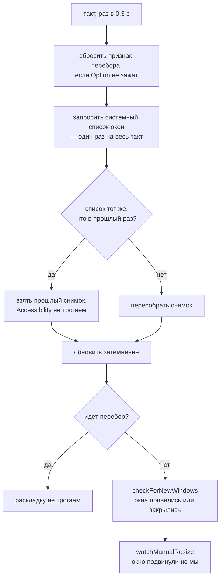
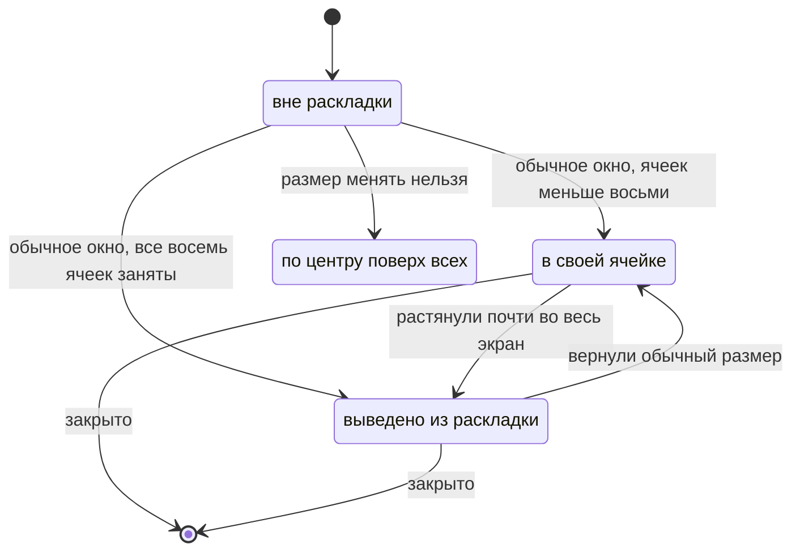
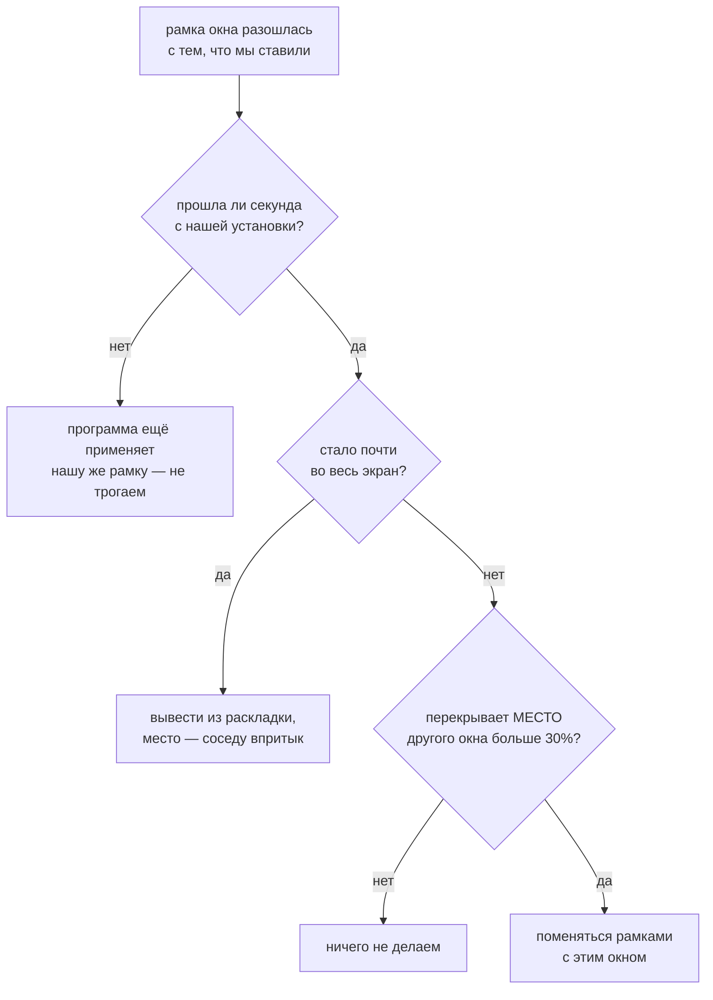

# Устройство WinCycle

Документ для того, кто будет менять код — свой или чужой. Здесь то, чего не видно из самого кода: почему сделано именно так, какие решения уже пробовали и отбросили, и на каких граблях этот проект уже прыгал.

Сам код — один файл `main.swift`, зависимостей за пределами AppKit и Carbon нет.

---

## 1. Из чего собрано

Три задачи в одном приложении, все три работают от одного и того же снимка окон.


Приватных API нет ни одного. Это не идеология, а необходимость: система на бете, всё недокументированное там ломается первым.

**Почему два источника, а не один.** `CGWindowList` знает, какие окна реально на экране и в каком порядке они лежат друг над другом, но двигать окна не умеет. Accessibility умеет двигать и знает заголовки, но не знает z-порядка и показывает окна с других рабочих столов. Нужно и то и другое, поэтому окна приходится сопоставлять между двумя списками — см. раздел 5, это самое хрупкое место во всём приложении.

---

## 2. Такт опроса

Всё происходит в одном таймере на 0.3 секунды. Отдельных наблюдателей за окнами нет: система не даёт уведомлений о том, что окно передвинули.



Список запрашивается **один раз за такт**, и снимок по нему строится тоже один — им пользуются все три задачи. Это не только экономия: если каждая опросит систему сама, они увидят чуть разные состояния и начнут спорить друг с другом.

Во время перебора раскладка намеренно молчит — иначе окно, поднятое на передний план, тут же считалось бы переставленным.

### Почему такт почти всегда пустой

Все решения выводятся из системного списка окон: какие окна есть, чьи они и где стоят. **Пока этот список не изменился, ни одно решение измениться не может** — значит и пересобирать снимок незачем. Экран почти всё время стоит без движения, так что подавляющее большинство тактов заканчивается сравнением списка с прошлым и выходом.

Что даёт этот признак право быть полным:

- свёрнутые окна и окна программ, спрятанных через Command+H, система **сама** убирает из списка (проверено вживую на обоих способах) — отдельно спрашивать Accessibility не нужно;
- полноэкранный режим меняет рамку окна, а рамка в признаке есть;
- порядок записей в списке — это z-порядок, от него зависит затемнение, и он тоже в признаке.

**Заголовок окна в признак не входит намеренно.** У терминала в заголовке крутится значок ожидания, у браузера меняется название ролика — признак менялся бы каждый такт, и весь выигрыш пропал бы.

Дороже всего обходится сопоставление окна из системного списка с элементом Accessibility: запрос рамки и заголовка на каждого кандидата. Оно постоянно на всё время жизни окна, поэтому запоминается — при следующей пересборке для уже известного окна не делается ни одного обращения. Так же запоминаются неизменяемые свойства окна: обычное ли оно и можно ли менять ему размер.

Измерено вживую на трёх окнах: **1.16 с процессорного времени за минуту до и 0.13 с после** — почти девятикратная разница. Основной вклад дали три вещи: пропуск такта целиком, снятие двойной работы (затемнение собирало собственный снимок, то есть вся работа с Accessibility делалась дважды за такт) и запоминание сопоставлений.

---

## 3. Раскладка: динамическое деление

Не фиксированная сетка, где форма ячейки зависит только от счёта (была такая версия, продержалась недолго — см. раздел 11, там же почему от неё отказались), а живое дерево делений, как в dwindle или в любом BSP-тайлинге: у каждого окна — своя собственная рамка (`lastAppliedFrame`), и открытие нового окна делит пополам **рамку активного окна**, а не какую-то заранее известную по счёту ячейку.

Новое окно встаёт в правую половину ячейки активного, активное ужимается в левую половину той же ячейки — вертикальным делением, «новое окно справа», без исключений. Остальные окна на экране при этом не трогаются вовсе: раз их ячейки не участвовали в делении, их рамки и не должны меняться.

```
было: активное окно А одно в своей ячейке, B — сосед, C — где-то ещё

┌─────────┬───────┐        ┌────┬────┬───────┐
│         │       │        │    │    │       │
│    A    │   C   │   →    │ A  │ N  │   C   │
│         │       │        │    │    │       │
├─────────┤       │        ├────┴────┤       │
│    B    │       │        │    B    │       │
└─────────┴───────┘        └─────────┴───────┘

открыли N, пока активно A: A и N поделили рамку A пополам,
B и C стоят на месте — их никто не трогал
```

Закрытие — обратная операция. У освободившейся рамки есть ровно один настоящий сосед по дереву — то самое окно, с которым её когда-то разделили одним движением (`siblingOf`), — ему она целиком и достаётся. Голой геометрии («кто стоит впритык») недостаточно: если A когда-то поделили на A|B, а потом B поделили ещё раз на B|C, то у A и C совершенно случайно может совпасть общая грань — оба стоят впритык к тому месту, где раньше было только B целиком. Без явной памяти о паре закрытие A могло бы по ошибке отдать место C. Если настоящий сосед сам куда-то делся (например, оба окна пары закрылись в один и тот же такт), ищем среди оставшихся хоть какого-то соседа впритык (`adjacentUnion`) — не идеально, но не оставляет дыру. Если и это не находится — аварийный пересчёт экрана целиком по счёту (`tileWindows`/`gridRects`), тот же принцип, что раньше был основным, здесь остался запасным путём.

Между окнами и по краю экрана — зазор 8pt, ровно такой же, какой даёт Raycast Window Management (измерено вживую).

### Предел в восемь ячеек

Дальше делить нечего — девятая долька на экране ноутбука уже нечитаема. Поэтому ячеек максимум восемь (`maxGridTiles`), а девятое и последующие окна ничью ячейку не делят вовсе: такое окно сразу растягивается на весь экран (`stretchBeyondCapacity`) — тем же движением, что и ручное растягивание, — и относится к `floated`. Восемь окон сетки при этом не трогаются вовсе.

Раньше здесь была стопка — шестое и последующие окна складывались друг на друга в последней ячейке (см. раздел 11). Авто-растягивание сверх восьми проще и предсказуемее: ни одна ячейка не становится незаметно уже трёхсот точек, а окна за пределами сетки ведут себя ровно так же, как окно, растянутое вручную, — то есть по уже отлаженному пути `floated`, не по отдельному новому.

### Что в раскладку не попадает

| Окно | Что с ним делают | Почему |
|---|---|---|
| Настоящий системный полноэкранный режим (`AXFullScreen`) | не трогают вовсе | живёт на отдельном рабочем столе |
| Размер менять нельзя (настройки системы, Command+,) | ставят по центру экрана поверх остальных | под ячейку его всё равно не растянуть |
| Растянуто почти во весь экран **вручную**, или девятое и далее по счёту открытия | временно выводится из раскладки (`floated`), соседи занимают освободившееся место | в обоих случаях верно одно и то же: окну сейчас нужен весь экран, а не своя ячейка; вернёт обычный размер — само вернётся в сетку |
| Свёрнутые, спрятанные Command+H, панели и диалоги | не попадают в снимок вообще | это не рабочие окна |
| `ignoredBundleIDs` | не попадают в снимок | точечный список для окон, неотличимых от настоящих никаким публичным признаком (найдено на фоновом окне VPN-клиента Happ) |

---

## 4. Жизненный цикл окна в раскладке



Окна, которые уже стояли на экране в момент запуска WinCycle, берутся под наблюдение сразу, но **не двигаются**: каждому «своей» объявляется та рамка, где оно и так стоит. Вид экрана не меняется, зато следующая же перестановка или новое окно пересчитают всё уже вместе с ними.

При динамическом делении настоящий порядок открытия узнать неоткуда (WinCycle не видел, как эти окна появлялись) и, в отличие от прежней фиксированной сетки, для дальнейшей работы он и не нужен — окна не привязаны к позиции в списке, у каждого своя независимая рамка. `siblingOf` для них при этом не заводится: если одно из уже стоявших на экране окон потом закроется, соседа для него ищем геометрически (`adjacentUnion`), а не по памяти о паре, — этого достаточно для той же цели.

---

## 5. Сопоставление окон: самое хрупкое место

Общего идентификатора между `CGWindowList` и Accessibility публичный API не даёт. Сопоставлять приходится по тому, что видно с обеих сторон: программа-владелец, координаты, заголовок.

Порядок такой:

1. отбросить элементы, уже отданные другому окну на этом же такте;
2. если свободный кандидат остался один — берём его, ошибиться негде;
3. если заголовок известен и совпал ровно с одним элементом — берём его;
4. иначе — ближайший по сумме отклонений рамки, с допуском.

Найденное сопоставление запоминается на всё время жизни окна — но **только если оно уверенное** (случаи 2 и 3). Если пришлось выбирать из нескольких неразличимых кандидатов, ошибка закрепилась бы навсегда; такое сопоставление используется на этот раз, но не запоминается, и на следующем изменении попытка повторяется — к тому времени окна обычно уже разъехались.

**Почему нельзя просто «первый, чья рамка совпала».** Ровно в том случае, ради которого вся раскладка и писалась — окно переставляют на место другого окна **той же программы** — оба окна на один такт стоят на одинаковых координатах. Оба сопоставляются с одним элементом, раскладка дважды двигает одно окно и ни разу второе, второе остаётся не на месте, на следующем такте это снова «ручное вмешательство» — и так до бесконечности. Вживую: два окна терминала, слипшихся в одной четверти, и журнал, заполняющийся пересчётом по нескольку раз в секунду.

Совпадение рамок и вне такой перестановки — штатная, не редкая ситуация: у `floated`-окон (растянутых вручную, а с восьмого окна ещё и растянутых автоматически сверх сетки, см. раздел 3) рамка одна и та же — весь экран, и таких окон на одном экране может быть сразу несколько. Поэтому однозначность сопоставления здесь не перестраховка, а обязательное условие.

---

## 6. Как распознаётся ручное вмешательство

Раскладка помнит, какую рамку сама поставила каждому окну (`lastAppliedFrame`). Расхождение с фактической означает, что окно подвинул кто-то другой.



Две вещи, каждая из которых уже была источником бага:

**Перекрытие, а не совпадение координат.** Чужие менеджеры окон считают свои половины и четверти независимо от нашей раскладки. Для половин координаты иногда случайно совпадают, для четвертей — почти никогда, даже когда визуально это одно и то же место. Поэтому ищем окно, чьё место новая рамка перекрывает больше всего.

**Сравнивать с `lastAppliedFrame` цели, а не с её текущим положением.** Два окна, переставленные в один такт, иначе не найдут друг друга: к моменту проверки оба уже уехали каждое со своего места.

### Перестановка — это обмен, а не каскад

У каждого окна теперь своя независимая рамка (см. раздел 3), а не место в общем списке — поэтому переставленное окно и то, что оказалось на его месте, просто **меняются рамками**, и всё. Раньше, при фиксированной сетке, это был каскад: окно вынималось из своего места в порядке и вставлялось перед целью, а всё, что было между, сдвигалось на шаг дальше по сетке — потому что там позиция в списке НАПРЯМУЮ определяла форму ячейки. Сейчас в этом нет смысла: ни одно третье окно не завязано на позицию переставленных двух, обмен их рамками ничего вокруг не трогает.

Пары-соседи (`siblingOf`) идут за рамкой, а не за именем окна: если A и B поменялись местами, то дальнейшее закрытие A должно отдать место туда, где сейчас физически стоит A (то есть бывшему месту B), — соответственно и сама запись `siblingOf` при обмене переезжает вместе с рамкой, не с окном.

---

## 7. Перебор окон и затемнение

**Перебор.** Порядок — не по истории переключений, а по кругу на экране: окна из плиток идут по часовой стрелке начиная с верхней левой четверти (`sortedClockwise`, раздел 3 — рекурсивное деление на четверти, то же самое, что и у сетки, только по фактическому положению, а не по счёту открытия), а растянутые окна — тем же кругом сразу следом, отдельным куском. Список отсортирован статически, а не «плитки, потом растянутые, потом снова плитки» динамически — поэтому обычный шаг по кругу уже сам даёт нужный результат без отдельного состояния: с последней плитки вперёд — на первое растянутое, а с последнего растянутого вперёд — снова на первую плитку, то есть на верхнюю левую четверть. Порядок снимается один раз в начале перебора и держится до отпускания Option — иначе список пересортировывался бы после каждой активации и «дальше» превращалось бы в прыжки между двумя окнами.

Раньше здесь было отдельное состояние — какие плитки уже показаны в этом туре и с какой из них тур начался, — чтобы не дать кругу перескочить к растянутым, пока показаны не все плитки, и чтобы после растянутых возвращаться не на первую плитку по кругу, а именно туда, откуда начали. Оно оказалось хрупким: набор «уже показанных» мог заполниться целиком и не сброситься вовремя (см. раздел 8, «Про состояние, которое переживает больше, чем должно»), и тогда шаг вперёд переставал находить свободную плитку — перебор не двигался вообще. С фиксированным кругом, начинающимся строго с верхней левой четверти, это состояние просто не нужно: результат после растянутых и так всегда один и тот же, известный заранее.

Признак «идёт перебор» гасится по отпусканию Option, но **дополнительно сверяется с фактическим состоянием клавиш на каждом такте**. Событие можно и не получить, а застрявший признак замораживает всю раскладку целиком.

**Затемнение.** Под активное окно подставляется полупрозрачная подложка во весь экран — всё, что под ней, притушено. Строка меню и Dock не затемняются: они на более высоком системном слое, обычным окном туда не дотянуться. Если на экране всего одно окно, подложка прячется — сравнивать не с чем, независимо от того, какого окно размера.

При переключении подложка двигается сразу, не дожидаясь следующего такта: иначе на треть секунды затемнённым оказалось бы как раз то окно, на которое переключились.

---

## 8. Ошибки, которые уже допущены

Каждая из них стоила отдельного круга «сломалось — разобрались — починили». Список нужен, чтобы не пройти его заново.

### Про угадывание намерений

**Эвристика «почти весь экран» по площади при первом взгляде на окно.** Порог 85% использовался, чтобы понять «человек развернул окно специально». Сломал раскладку дважды разными путями: сначала раскладка сама растягивала единственное окно на весь экран, а на следующем такте принимала его же за «развёрнуто специально» и забывала — тайлинг переставал работать после первого окна. Потом браузер восстановил из прошлой сессии старую растянутую рамку, и эвристика опять не пустила окно в раскладку.

> **Урок.** По размеру нельзя отличить «сделано специально» от «оказалось так по любой другой причине». Нужен либо честный системный признак (`AXFullScreen`), либо сравнение с собственным действием — «мы ставили сюда, а оно теперь там». Эвристика по площади осталась ровно в одном месте: применительно к расхождению с уже известной своей рамкой, где она заведомо безопасна — там она уже не может принять собственное размещение раскладки за чужое действие.

### Про асинхронность

**Мгновенное доверие расхождению рамки.** Просьба переставить окно выполняется не сразу: программа отвечает старой рамкой, пока применяет (а многие ещё и анимируют) новую. Только что размещённое окно тут же считалось переставленным вручную — по тому месту, где оно случайно открылось. На каждое новое окно шло два пересчёта подряд, второй по случайному поводу.

**Окно, пропавшее из снимка на один такт, принятое за закрытое.** Пока чужой менеджер двигает окно, два наших источника расходятся, сопоставить их не удаётся и окно исчезает из снимка. Раскладка успевала схлопнуться по числу оставшихся и развернуться обратно — видимый рывок соседних окон.

> **Урок.** Всё, что мы просим у чужой программы, выполняется не мгновенно и не обязательно точно. Ни расхождению, ни исчезновению нельзя верить с первого раза.

### Про состояние

**Экраны для пересчёта брались только из уже известной раскладки.** Сразу после запуска она пуста — и закрытие окна не приводило вообще ни к чему.

**Первый такт просто пропускал окна, уже стоявшие на экране.** Раскладка знала только окна, открытые после её запуска; всё остальное для неё не существовало, и перестановка такого окна не делала ничего. Особенно заметно после каждой пересборки — порядок живёт только в памяти.

**А когда их начали подхватывать — порядок брался из системного списка, то есть по слоям.** Записанный так порядок не имел отношения к тому, в каких ячейках окна реально стоят, и первый же пересчёт перекладывал всю раскладку заново. Причём слои меняются от любого переключения, так что результат зависел ещё и от того, на какое окно человек смотрел последним.

**Признак «идёт перебор» гасился только по событию.** Не пришло событие — признак остался взведённым, и вся раскладка замерла навсегда.

> **Урок.** Состояние, которое взводится событием, должно иметь способ восстановиться без события. И состояние, которое живёт только в памяти, обязано корректно подниматься с нуля на живом экране — это не редкий случай, а каждый запуск.

### Про новую сущность, ломающую старые допущения

Стопка добавилась последней и сломала сразу три места, каждое из которых до неё работало годами правильно — просто потому, что все они молча считали рамки окон различными.

**Соседи по стопке считали друг друга захватчиками ячейки.** Перекрытие у них всегда полное, поэтому малейшее расхождение рамки внутри стопки распознавалось как перестановка. Раскладка перетасовывалась сама по себе, окна прыгали между ячейками по шагу каждые пару секунд — особенно заметно при переборе, когда окно стопки поднимают на передний план.

**Перебор застревал внутри стопки.** У окон стопки общий центр, значит одинаковый угол в круговой сортировке; их взаимный порядок брался из входного списка, а тот идёт по слоям и меняется от каждого переключения. Перебор бесконечно прыгал между двумя окнами и дальше не шёл.

**Выбор перебором стирался следующим пересчётом.** Наверх стопки безусловно поднималось последнее окно по порядку раскладки, а не выбранное.

> **Урок.** Новая сущность, для которой прежнее неявное допущение перестаёт выполняться, ломает не одно место, а все, что на него опирались. Стоит выписать допущение явно («рамки окон различны») и пройти по всем его потребителям, а не чинить по одному месту за раз по мере жалоб.

### Про лишнюю работу

**Затемнение собирало собственный снимок окон.** Внутри у него была своя проверка «сколько всего окон на экране», и она вызывала полный сбор — со всеми обращениями к Accessibility. А сразу после этого тот же сбор делал таймер для раскладки. Вся тяжёлая работа выполнялась дважды за каждый такт, и по коду это было не видно: два разных места, каждое по отдельности выглядело разумно.

**Каждый такт спрашивалось то, что уже известно.** Свёрнуто ли окно и спрятана ли программа — отдельные запросы к Accessibility на каждое окно, хотя система и так не показывает такие окна в списке. Обычное ли это окно и можно ли менять ему размер — свойства, которые за жизнь окна не меняются, а спрашивались три раза в секунду. Сопоставление с элементом Accessibility — самая дорогая операция из всех — пересчитывалось с нуля каждый такт, хотя оно постоянно.

> **Урок.** Опрос по таймеру прячет стоимость: всё «работает», просто греет процессор. Прежде чем ускорять сам обход, стоит посмотреть, что из него вообще можно не делать — сколько раз за такт спрашивается одно и то же, и что из спрошенного не могло измениться с прошлого раза. Здесь это дало почти девятикратную разницу без единого изменения в поведении.

### Про индексы и симметрию

**Номер ячейки-цели читался после изъятия окна из порядка.** Перестановка вперёд по спирали не делала вообще ничего: окно вставлялось туда, откуда его только что взяли. В обратную сторону работало, потому что там изъятие номер цели не меняет.

> **Урок.** Индексы в изменяемом массиве брать до мутации. И проверять **оба** направления: все ранние проверки этого механизма шли «назад по спирали», поэтому баг прожил несколько итераций незамеченным.

### Про состояние, которое переживает больше, чем должно

**Тур по плиткам вокруг растянутых окон.** Чтобы перебор не «срезал» к растянутому окну раньше, чем показаны все плитки, было заведено состояние: какие плитки уже показаны в этом туре, и с какой из них тур начался (чтобы после растянутых вернуться именно туда). Явно задумано так, чтобы это состояние переживало не только удержание Option, но и отдельные нажатия Tab с его отпусканием между ними — расчёт был на то, что человек может отпускать Option между нажатиями, а тур всё равно должен продолжаться.

Ровно это и сломало его: без надёжного признака «это тот же тур или новый» набор «уже показанных» рано или поздно заполнялся целиком (все плитки уже отмечены) и не сбрасывался, если круг не успевал вернуться ровно туда, откуда тур начинался, — например, если человек ушёл с активного окна кликом мыши, а не Tab’ом. Дальше каждое нажатие «вперёд» перебирало полный круг, не находило ни одной ещё не показанной плитки — и не двигалось вообще. Перебор выглядел полностью сломанным при самом обычном использовании, без единого растянутого окна на экране: набор накапливался и заполнялся ото всех предыдущих сеансов подряд.

Заменено на статичный, всегда предсказуемый круг: плитки идут по часовой стрелке строго начиная с верхней левой четверти (раздел 7), а не по общему углу вокруг подвижного центра. При такой сортировке простой шаг по кругу без всякого запоминания уже даёт нужный результат — с последнего растянутого шаг вперёд сам попадает на первую плитку по кругу, то есть на верхнюю левую, без явного «вернуться туда, откуда начали».

> **Урок.** Состояние, заведённое ради одного конкретного порядка обхода, стоит попробовать заменить самим порядком — если круг предсказуем и его начало не гуляет, часто можно обойтись без явной памяти вообще. А если состояние всё же нужно, у него должен быть однозначный способ понять, что оно устарело, а не только способ его накопить.

### Про методику проверки

**Сборка не той копии.** `build.sh` делает `cd "$(dirname "$0")"` и собирает `main.swift` из своей папки. Запуск копии скрипта из другого чекаута собирает **тот** чекаут — правки молча не попадают в сборку, и все проверки идут по старому коду.

**Вывод «проблема снаружи» без воспроизведения.** Однажды было заявлено, что горячие клавиши для четвертей просто не назначены в чужом менеджере окон. Они были назначены; баг был свой.

> **Урок.** Проверять тем же способом, каким пользуется человек, — настоящими горячими клавишами, а не синтетической перестановкой напрямую. И убеждаться, что запущено именно то, что только что правил.

---

## 9. Как проверять изменения

Пересобрать и запустить: `sh ./build.sh` **из той папки, где правили код**.

Что смотреть:

- **Журнал** — `~/Library/Logs/WinCycle.log`. Строка `сетка: N окон — ...` на каждый пересчёт, с порядком окон. Две такие строки подряд с разным порядком — почти всегда признак ложного срабатывания распознавания ручных перестановок.
- **Фактические координаты** — читать `CGWindowListCopyWindowInfo` отдельным скриптом, а не верить журналу на слово: журнал показывает намерение раскладки, а не то, что программа в итоге сделала.
- **Настоящие горячие клавиши** — `osascript -e 'tell application "System Events" to key code N using {...}'`, предварительно наведя фокус на нужную программу. Имя процесса не всегда совпадает с названием: у веб-приложения это `Web App`.

Обязательный минимум перед тем, как считать изменение готовым:

1. рост числа окон 1 → 8 → 9: каждое новое делит ровно ячейку активного, остальные окна не двигаются вовсе (сверить координаты соседей до и после — должны совпасть один в один); девятое сразу растягивается на весь экран, не втискиваясь в сетку;
2. закрытие окна из середины — освободившееся место получает ровно тот сосед, с которым это окно делили в паре (не любой геометрический сосед впритык, если их несколько — см. раздел 3, `siblingOf`), а остальные окна не двигаются;
3. перестановка клавишами **в обе стороны** — переставленное и то, что было на его месте, меняются рамками, третьи окна не трогаются;
4. перестановка сразу после перезапуска, без открытия и закрытия лишних окон;
5. окно с фиксированным размером (настройки любой программы через Command+,);
6. расход процессора в покое.

Расход мерить по накопленному процессорному времени, а не по мгновенному проценту:

```sh
PID=$(pgrep WinCycle); ps -o time= -p $PID; sleep 60; ps -o time= -p $PID
```

Ориентир на трёх окнах — около **0.13 с за минуту**. Если стало заметно больше, значит признак «экран не изменился» перестал срабатывать и снимок пересобирается каждый такт. Первый подозреваемый — что-то меняющееся само по себе попало в признак.

---

## 10. Рабочие столы (Spaces)

Проверено вживую (пользователь создал второй стол через Mission Control и переключился туда и обратно, я следил за журналом и координатами): переключение стола **не сбрасывает раскладку**. Журнал за всё время переключения — полностью пустой, ни намёка на закрытие или пересчёт. Значит `CGWindowListCopyWindowInfo` с флагом `.optionOnScreenOnly` в этой версии macOS не убирает окна с неактивного стола того же дисплея из списка — опасение, что переключение стола выглядело бы для раскладки как закрытие всех окон разом, не подтвердилось.

Отдельно проверено (безопасным способом, без реального второго стола): запрос БЕЗ `.optionOnScreenOnly` видит окна, даже когда они свёрнуты — то есть в принципе отличить «окно закрыто» от «просто сейчас не видно» технически можно, если такая необходимость всё же когда-нибудь возникнет (например, на другой машине или версии системы, где поведение окажется иным). Делать это сейчас не стали — живой тест показал, что проблема не проявляется.

---

## 11. Что пробовали и отбросили

Готовые приложения — до того, как стало ясно, что своя утилита закрывает обе задачи лучше любой их комбинации:

| Что | Почему не подошло |
|---|---|
| AltTab | всегда рисует свою панель, фокус переводит только по отпусканию клавиши — живого перебора не даёт |
| JankyBorders | приватные API, открытые проблемы на свежих версиях системы |
| Tinkle | вспышка при переключении слишком слабая, не замечается |
| Alan | постоянная рамка вокруг окна |
| HazeOver | платный; заявленное размытие в нём кодом не подкреплено |
| Dimsum | работал через раз |

Своё размытие фона вместо затемнения тоже написали и отбросили: системные материалы `NSVisualEffectView` несут зернистую текстуру, на весь экран она читается как шум, убрать её нечем, а других способов размытия без приватных API нет.

Встроенной команды переключения окон у Raycast нет вовсе. Системное Command+ё («Следующее окно программы») работает, но только внутри одной программы.

### Раскладка: dwindle-спираль со стопкой поверх пяти ячеек

Самая первая версия раскладки. Первое окно занимало экран целиком, каждое следующее делило пополам ячейку **последнего добавленного** окна, направление деления выбиралось по пропорциям самой ячейки (широкая — вертикально, высокая — горизонтально). Получалась спираль: одно большое окно и всё более мелкие рядом с ним, вглубь до пяти ячеек, а всё сверх — стопкой в последней.

От стопки отказались отдельно (см. следующую запись) — вместе с ней исчезли три места, которые из-за неё усложнялись специальной обработкой совпадающих рамок (раздел 8, «Про новую сущность, ломающую старые допущения»): сопоставление с Accessibility, распознавание ручных перестановок, круговая сортировка перебора.

### Раскладка: фиксированная сетка до восьми ячеек

Промежуточная версия между dwindle-спиралью и текущим динамическим делением (раздел 3). Форма всех ячеек была выписана целиком как таблица случаев на каждое число открытых окон n от 1 до 8 — не рекурсия, а прямое перечисление: экран делится пополам, потом одна половина на четверти, потом каждая четверть по очереди на восьмые, всегда в одном и том же порядке, по часовой стрелке.

Отказались сразу же, ещё до того, как эта версия успела попасть в коммит: при попытке сделать «новое окно встаёт рядом с активным» выяснилось, что этого в принципе не может дать таблица случаев, завязанная только на счёт. Какая именно ячейка делится при переходе от n к n+1 — жёстко прописано заранее (например, при n=5 всегда делится верхняя правая четверть) и не зависит от того, где сейчас активное окно. Если активное окно не в той ячейке, что «положена» под очередное деление по счёту, — новое окно появляется не рядом с ним, а там, где предписывает таблица, зачастую в другом углу экрана.

Ровно та же причина, по которой раньше отказались от dwindle-спирали (предыдущая запись), только с обратным знаком: там место новой ячейки зависело ТОЛЬКО от истории переключений, здесь — ТОЛЬКО от счёта, а нужно было и то, и другое сразу: делить именно ячейку активного окна (значит — зависеть от фокуса), но не городить дерево. Текущее устройство (раздел 3) берёт правильную часть из каждой идеи: как в dwindle — делит рамку активного окна напрямую, без таблицы случаев; как в фиксированной сетке — направление деления всегда одно и то же (вертикальное, новое окно справа), а не выбирается по пропорциям ячейки, как в исходном dwindle, — с этим было сложнее объяснить пользователю, куда именно попадёт новое окно.

> **Урок.** Прежде чем переносить готовую схему («у нас уже есть таблица случаев, она чистая и предсказуемая») на новое требование, стоит проверить: не противоречит ли эта схема самому смыслу требования. «Ячейки не по фиксированному сценарию, а по счёту» и «новое окно рядом с активным» — взаимоисключающие формулировки одного и того же места в дизайне, а не два независимых требования, которые можно добавить одно поверх другого.
