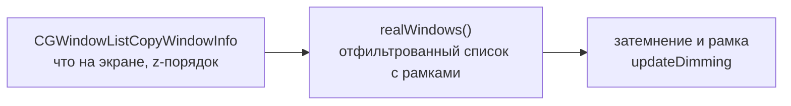

# Устройство WinCycle

Документ для того, кто будет менять код — свой или чужой. Здесь то, чего не видно из самого кода: почему сделано именно так, какие решения уже пробовали и отбросили, и на каких граблях этот проект уже прыгал.

Сам код — один файл `main.swift`, зависимостей за пределами AppKit нет.

> Раньше в этом файле умели ещё перебор окон (Option+Tab) и dwindle-тайлинг новых окон — вся эта функциональность и связанная с ней инфраструктура (Carbon-горячие клавиши, Accessibility API, сопоставление системного списка окон с AX-элементами) удалены целиком по прямой просьбе, осталось только затемнение. Разделы про раскладку и перебор из этого документа тоже убраны — им больше нечего описывать.

---

## 1. Из чего собрано

Одна задача, один источник данных.

Приватных API нет ни одного, и Accessibility тоже не используется: `CGWindowListCopyWindowInfo` даёт всё нужное — какие окна реально на экране и в каком порядке они лежат друг над другом. Двигать чужие окна WinCycle не пытается вовсе, поэтому Accessibility ему и не нужна — переставляются только собственные прозрачные подложки (`NSWindow.order(.below, relativeTo:)`), а это делается штатным AppKit API без каких-либо разрешений.

**Значок в строке меню открывает `NSPopover`, а не `NSMenu`.** Раньше был обычный `statusItem.menu` с ползунками в кастомных `NSView` внутри `NSMenuItem` — рабочий на вид приём, но с багом в самом AppKit (разобран в разделе 6): после первого перетаскивания ползунка `NSMenu` переставала передавать вью дальнейшие события мыши до тех пор, пока меню не закроется и не откроется заново. `NSPopover` — обычное окно, этой особенности лишено: виджеты внутри него (`makeDimSliderView`, `makeGlassSliderView`, чекбокс рамки, кнопка «Выход») ведут себя как в любом другом окне AppKit.

---

## 2. Такт опроса

Две независимые точки обновления:

- уведомление `NSWorkspace.didActivateApplicationNotification` — срабатывает мгновенно при смене активной программы;
- таймер на 0.3 секунды — добирает переключение между окнами одной и той же программы, которое уведомление не ловит.

Обе точки вызывают один и тот же `updateDimming`, порядок подложек трогается только когда самое переднее окно действительно сменилось (`force || front != lastFront`) — иначе на каждом такте было бы видимое мерцание.

---

## 3. Затемнение

Под самое переднее обычное окно подставляется полупрозрачная подложка (`Overlay`/`ShadeView`) во весь экран — всё, что оказалось под ней, притушено. Подложка:

- не перехватывает мышь (`ignoresMouseEvents`);
- висит на всех рабочих столах (`canJoinAllSpaces, .stationary`);
- никогда не становится активным окном (`canBecomeKey`/`canBecomeMain` — `false`).

Строка меню и Dock не затемняются: они на более высоком системном слое, обычным окном туда не дотянуться.

**Заливка плоская** — `ShadeView.draw()` закрашивает весь `bounds` одним цветом, `NSColor.black.withAlphaComponent(dimAlpha)`. Пробовали заменить на виньетку — см. раздел 8.

**Список окон для подсчёта** — `realWindows()`. Берёт `CGWindowListCopyWindowInfo` (слой 0, видимое на экране) вместе с рамкой каждого окна (рамка нужна ещё и рамке-подсветке активного окна, раздел 4) и по пути отфильтровывает:

| Что отфильтровывается | Почему |
|---|---|
| собственные подложки | иначе подложка считала бы сама себя вторым окном |
| альфа < 0.01 | окно есть в списке, но фактически невидимо |
| меньше 100×100 точек | мелкие всплывающие панельки — не рабочие окна |
| программы вне `.regular` (значки в строке меню и подобные) | переключаться на них бессмысленно, их не с чем сравнивать |
| программы, спрятанные Command+H | окно осталось в системном списке, но реально не на экране |
| `ignoredBundleIDs` | точечный список для окон, неотличимых от настоящих никаким публичным признаком (найдено на фоновом окне VPN-клиента Happ — `su.ffg.happ`) |

**Если реальных окон на экране одно или ноль — подложки прячутся.** Затемнять относительно чего? Сравнивать не с чем, а тёмная рамка по краям только мешала бы.

**Смена активного окна на лету.** При переключении между окнами (например, кликом) подложка двигается сразу по уведомлению, не дожидаясь следующего такта опроса — иначе на треть секунды затемнённым оказывалось бы как раз то окно, на которое переключились.

---

## 4. Рамка вокруг активного окна

Независимый от затемнения переключатель (вкл/выкл, без силы — в отличие от затемнения и стекла, у обводки нет естественной шкалы). Вместо того чтобы притушивать соседей, подсвечивает само активное окно: `BorderOverlay` — ещё одно маленькое borderless-окно, поставленное `orderFrontRegardless()` поверх всего, размером ровно с рамку активного окна плюс небольшой отступ, с скруглённой обводкой (`NSBezierPath` stroke) и мягкой тенью того же цвета для свечения.

**Рамка не трогает чужие окна вообще** — в отличие от затемнения и стекла, здесь не нужно доказывать, что эффект пересекает границу процессов: рисуем только своё окно, поверх всех остальных. Именно поэтому это самый безрисковый из всех трёх эффектов — сработает всегда, никаких системных ключей и допущений о поведении WindowServer.

**Откуда рамка знает границы активного окна.** `realWindows()` (см. раздел 3) уже вынимает рамку каждого окна из `CGWindowListCopyWindowInfo` — `showBorder(around:)` берёт рамку самого первого (переднего) окна из этого списка и переводит её из системных координат CGWindowList (сверху слева, без переворота) в кокоавские (снизу слева) тем же способом, что раньше использовался для фуллскрина. Пересчитывается на каждом такте опроса, но фактически двигает окно только когда рамка правда изменилась (`lastBorderFrame`) — иначе на каждый тик была бы лишняя запись в оконный сервер вхолостую.

**Что пробовали и отбросили: обесцвечивание неактивных окон.** Была идея вместо тёмной подложки просто делать соседние окна чёрно-белыми — через `CALayer.compositingFilter` с Core Image blend-режимом `CISaturationBlendMode` (насыщенность слоя 0 → результат берёт оттенок/яркость фона и насыщенность слоя, то есть должен получаться ч/б фон). Проверено вживую на чистом тестовом окне с шестью яркими цветными полосами: подложка с этим фильтром отрисовалась сплошным непрозрачным серым, полностью закрыв всё под собой, а не смешавшись с ним.

> **Урок.** `compositingFilter` смешивает слой с тем, что находится **позади него в том же дереве слоёв того же окна**, а не с содержимым чужих окон ниже в системном стеке — WindowServer между отдельными окнами разных процессов поддерживает только простое alpha-over (это и используют затемнение и рамка), а не произвольные Core Image blend-режимы. Тот же принципиальный потолок, что и у размытия (раздел 5): любой эффект, который должен пересекать границу процессов, ограничен простым alpha-blending, если не лезть в приватные API уровня WindowServer.

---

## 5. Жидкое стекло (эксперимент, macOS 26+)

Независимый от затемнения ползунок в меню (0–100%, 0 — выключено, как и у затемнения): подкладывает под тот же `Overlay` ещё один слой — `NSGlassEffectView` (Liquid Glass, публичный API AppKit, новый в macOS 26) — с прозрачным `tintColor`, то есть без собственного тонирования, только размытие. Оба слоя живут в одном контейнере (`contentView` окна-подложки — обычный `NSView`, а `shade` и стекло — его сабвью). Пункт меню оборачивается в `if #available(macOS 26.0, *)` и на более старых системах просто не показывается; `Info.plist` при этом не трогали (`LSMinimumSystemVersion` остаётся 13.0) — затемнение по-прежнему работает везде, стекло — чистая надстройка сверху.

**Почему это отдельный слой, а не замена затемнению.** У `NSGlassEffectView` получается настоящее размытие содержимого позади окна — включая окна ДРУГИХ программ, не только своего приложения — без приватных вызовов. Подтверждено вживую: полноэкранная подложка с `NSGlassEffectView` размывает произвольное окно на заднем плане чисто, без зерна, которое раньше не удавалось убрать у `NSVisualEffectView` (см. ниже, раздел 8).

**У самого класса нет параметра силы размытия.** Полный список того, что публично отдаёт `NSGlassEffectView` (вытащено через `class_copyPropertyList`/`class_copyMethodList`, а не по документации): `tintColor`, `cornerRadius`, `cornerConfiguration`, `clipsToBounds`, `contentView`, `style` — и всё. Ни радиуса, ни интенсивности размытия нет ни в публичном API, ни в доступных приватных проперти (`_variant`, `_subvariant` и подобные — это внутренние дискретные состояния адаптации, не непрерывный параметр). `style` имеет всего два значения, `.regular` и `.clear`, визуально почти неотличимые по силе размытия — разница в характере тонирования, не в интенсивности. `tintColor` при этом ведёт себя нелинейно (рост alpha чёрного тона делает картинку под стеклом **светлее**, не темнее — измерено по шагам 0 → 0.95), так что и слайдер силы через `tintColor` не построить. Поэтому у стекла нет своей ручки — сила размытия регулируется в обход самого класса, через системный ключ (ниже).

### `NSGlassTintAmount` — системный ключ, а не параметр окна

За ползунком «Liquid Glass» в Системные настройки → Оформление стоит недокументированный глобальный ключ `NSGlassTintAmount` (`defaults read -g NSGlassTintAmount`) — это настройка на весь Liquid Glass в системе (Safari, Finder, Пункт управления, сама System Settings), а не свойство одного окна или процесса. Проверено вживую (0.02 против 0.98 через отдельные процессы — чётко видная разница в читаемости позади стекла): значение реально управляет размытием. WinCycle пишет и читает его через сам `/usr/bin/defaults` (`Process`), а не через `CFPreferencesSetValue`/`CFPreferencesCopyValue` напрямую — на этой версии системы прямой CFPreferences с `kCFPreferencesAnyApplication` (и даже с явным `"NSGlobalDomain"`) молча уходит в другое хранилище, не то же самое, что читает `defaults -g` и сама System Settings; расхождение подтверждено экспериментально, разбираться в устройстве cfprefsd дальше не стали — раз единственный подтверждённо рабочий путь есть, используем его.

Ключ **глобальный**, поэтому ползунок в WinCycle трогает его только пока включён (значение > 0%), запоминает то, что было ДО этого, и возвращает обратно при выключении (0%) или при выходе из WinCycle (`applicationWillTerminate` — подстраховка на случай Cmd+Q или принудительного завершения; `pkill`/`kill -9` эту подстраховку, разумеется, не поймает, тут ничего не поделать).

**Оригинал хранится на диске (`UserDefaults`, ключи `hasSavedSystemGlassTint`/`savedSystemGlassTint`), а не только в памяти Controller.** Раз ползунок теперь перезапускает процесс (ниже), хранить оригинал только в оперативной переменной нельзя: следующий процесс в цепочке перезапусков увидел бы уже записанное WinCycle значение и принял бы его за настоящий системный оригинал — из-за этого при выключении стекла восстанавливалось не то, что было в системе изначально, а промежуточное значение самого WinCycle. `hasSavedSystemGlassTint` — отдельный признак «оригинал уже сохранён» (в этом заходе ползунка), отличающий «ещё не трогали» от «оригинал случайно оказался пустым».

### Ползунок живой только через перезапуск процесса

`NSGlassEffectView` читает `NSGlassTintAmount` **один раз за весь процесс**, а не за окно и не за конкретный экземпляр. Проверено тремя разными способами, каждый следующий — на случай, если предыдущий давал ложноположительный результат:

1. переписать значение и оставить тот же экземпляр `NSGlassEffectView` на месте — пиксель-в-пиксель одинаковые скриншоты (0% и 91%);
2. вынуть экземпляр и вставить обратно тот же — тоже одинаковые (edge-энергия совпадает с точностью до шума);
3. создать совсем новое окно с совсем новым `NSGlassEffectView` **внутри того же процесса** — тоже одинаковые.

Меняется только между разными **процессами**: два отдельных запуска `swiftc`-собранного бинарника при 0.02 и 0.98 дают чётко разную картинку. Значит, единственный способ дать пользователю живой ползунок — перезапускать сам процесс WinCycle.

**Первая версия перезапуска была через `execv`** (заменяет образ текущего процесса на свежий с тем же PID) — новое значение стекла действительно подхватывалось, но значок в строке меню после этого пропадал насовсем. `execv` не даёт AppKit нормально закрыть соединение с оконным сервером перед тем, как процесс заменят, — `NSStatusItem` остаётся зарегистрирован на старое, уже неживое соединение, и новый образ процесса поднять взамен него рабочий значок не может.

**Итоговая версия — честный новый процесс.** `Controller.relaunchSelf()` спускает `/usr/bin/open -n` на тот же `.app` (создаёт НОВЫЙ процесс) и сразу зовёт `NSApp.terminate(nil)` у старого — так соединение со строкой меню освобождается штатно, как при обычном выходе, и новый процесс поднимает свой значок с нуля. Есть окно гонки: новый процесс на старте проверяет, что копия ровно одна (см. раздел 1), и может на мгновение увидеть ещё не до конца завершившийся старый — проверка при обнаружении дубля не сдаётся сразу, а перепроверяет до секунды (по 100мс), прежде чем считать это настоящим повторным запуском.

Перезапуск происходит не на каждый шаг перетаскивания ползунка (иначе их были бы десятки за одно движение), а один раз, когда отпустили мышь — определяется по `NSApp.currentEvent?.type == .leftMouseUp` в обработчике слайдера. `applicationWillTerminate()` при самоперезапуске (`isRelaunching == true`) не должен откатывать `NSGlassTintAmount` обратно — иначе новый процесс увидел бы старое значение вместо только что выставленного; откат нужен только при настоящем выходе.

---

## 6. Ошибки, которые уже допущены

### Про разрешения после урезания функциональности

Когда из приложения убрали перебор и тайлинг (а вместе с ними — всю Accessibility-инфраструктуру), осталась только `CGWindowListCopyWindowInfo`, которая никаких разрешений не требует. Разрешение «Универсальный доступ», вокруг сохранения которого была выстроена вся система постоянной подписи в `build.sh`, для оставшейся функциональности больше не нужно вовсе.

> **Урок.** После того как выпилена крупная часть функциональности, стоит перепроверить не только код, но и всё, что было обвязкой вокруг неё, — разрешения, права, комментарии в соседних файлах. Обвязка часто переживает саму функциональность и вводит в заблуждение о том, что приложению всё ещё нужно.

### Про методику проверки

**Сборка не той копии.** `build.sh` делает `cd "$(dirname "$0")"` и собирает `main.swift` из своей папки. Запуск копии скрипта из другого чекаута собирает **тот** чекаут — правки молча не попадают в сборку, и все проверки идут по старому коду.

> **Урок.** Убеждаться, что запущено именно то, что только что правил, — не полагаться на память о том, откуда в прошлый раз собирали.

### Про доверие первому же «заработало»

При отладке живого обновления «Жидкого стекла» дважды подряд показалось, что фикс сработал: сначала стандартный трюк «вынуть вью и вставить обратно» дал на одном скриншоте резкий скачок яркости — и это было принято за подтверждение, хотя фон между кадрами был живым (менялось видео), а не статичным. Второй раз — «10% против 80%» на реальном приложении — тоже сперва показалось убедительным на глаз, а числовая проверка (edge-энергия, `ImageChops.difference`) тут же показала: картинки пиксель-в-пиксель одинаковые, разницы нет вообще. Настоящая причина (кэш на процесс, а не на окно) нашлась только после того, как для сравнения стали брать статичный фон и точную попиксельную разницу, а не общее зрительное впечатление от двух скриншотов подряд.

> **Урок.** «На скриншоте вроде бы стало по-другому» — не доказательство, если фон между двумя кадрами мог измениться сам по себе (играющее видео, разная прокрутка). Сравнивать нужно один и тот же статичный кадр и считать точную разницу (pixel diff, edge-энергия), а не полагаться на глаз, тем более при беглом сравнении по памяти.

### Про самоперезапуск через execv

Первая версия «живого» ползунка стекла перезапускала процесс через `execv` — заменяет образ текущего процесса на свежий с тем же PID, дешевле честного нового процесса. Автоматическая проверка (см. выше) не отловила проблему: журнал показывал новую строку `запуск`, PID не менялся — с виду перезапуск сработал. Только когда сам пользователь потрогал ползунок живьём, обнаружилось, что значок в строке меню после этого пропадает насовсем. `execv` не даёт AppKit закрыть соединение с оконным сервером перед заменой образа — `NSStatusItem` остаётся висеть на уже неживом соединении, а новый образ процесса взамен него ничего поднять не может.

> **Урок.** «Процесс перезапустился и не упал» — не то же самое, что «перезапустился правильно». Для GUI-приложения любой трюк, подменяющий процесс в обход обычного пути запуска/выхода (`execv` вместо `NSApp.terminate` + новый процесс), рискует оставить в неопределённом состоянии как раз то, что не проверяется логом или PID, — соединения с оконным сервером, строку меню, systemUI-элементы. Дешёвый трюк стоит проверять именно на том, ради чего он рискован, а не только на том, что легко проверить.

### Про восстановление значения поперёк перезапусков

Когда ползунок стал перезапускать процесс, обнаружился второй слой той же ошибки: «оригинальное» значение `NSGlassTintAmount` (то, что было в системе ДО того, как WinCycle его тронул) хранилось только в памяти `Controller`. При каждом перезапуске новый процесс на старте видел уже записанное WinCycle значение и принимал ЕГО за оригинал — на выключении стекла восстанавливалось не то, что было в системе изначально, а промежуточное значение из середины цепочки перезапусков.

> **Урок.** Если операция стала пересекать границу перезапуска процесса, любое состояние, живущее только в памяти, нужно перепроверить — валидно ли оно всё ещё, если процесс, который его держал, к этому моменту уже другой. «Сохранить, чтобы восстановить потом» перестаёт работать корректно, если «потом» может наступить в другом процессе.

### Про NSSlider внутри NSMenuItem — работает только один раз

Ползунки жили в кастомных `NSView` внутри `NSMenuItem.view` с самого начала (см. историю коммитов) и во всех тестах этой сессии — синтетических (CGEvent) и через Accessibility — вели себя нормально. Баг всплыл только когда пользователь потрогал ползунок на своём компьютере вживую: **первое перетаскивание двигает ползунок нормально, второе — в том же открытом меню — не двигает вообще**, хотя приложение не падает и не виснет. Закрыть меню и открыть заново — можно подвинуть ещё один раз, и снова только один.

Не поймали раньше потому, что вся методика проверки в этой сессии (см. «Про доверие первому же „заработало“» выше) неизменно закрывала и заново открывала меню между проверками — ни разу не было теста «два перетаскивания подряд в одном открытом меню», а именно это и ломается. Когда наконец воспроизвели прицельно (`real_click_drag drag` дважды подряд без закрытия меню между ними, с точными координатами ползунка, взятыми из `position`/`size` через Accessibility), баг стабильно повторился и на синтетических событиях, и вручную.

Причина — не в нашем коде, а в самом `NSMenu`: у него есть отдельная, недокументированная сессия отслеживания мыши для кастомных `NSMenuItem.view`, и после первого полного цикла mouseDown→mouseDragged→mouseUp она перестаёт передавать вью дальнейшие события, пока меню не будет закрыто и открыто заново. Никакая правка вокруг `NSSlider` эту сессию не чинит — сам контейнер `NSMenu` её не даёт возобновить.

**Фикс — не чинить `NSMenu`, а не использовать её для этого вовсе.** Строка меню теперь открывает `NSPopover` (обычное окно AppKit) вместо выпадающего `NSMenu`; кнопка «Выход» и чекбокс рамки стали обычными `NSButton`, ползунки — тем же `NSSlider`, что и раньше, просто не внутри `NSMenuItem`. Проверено: три перетаскивания подряд в одном открытом попапе — каждое отражается на значении, ничего не виснет.

> **Урок.** «Работает при синтетическом тестировании» — не то же самое, что «работает при обычном использовании», если методика тестирования систематически не воспроизводит порядок действий живого человека (открыл — подвигал — подвигал ещё раз — закрыл, а не открыл — подвигал — закрыл — открыл — подвигал). А если баг оказался в самом `NSMenu`, а не в компоновке вью внутри него, — не тратить время на то, чтобы обойти особенность фреймворка, а заменить сам механизм (`NSPopover` вместо `NSMenu`) на тот, где этой особенности нет в принципе.

---

## 7. Как проверять изменения

Пересобрать и запустить: `sh ./build.sh` **из той папки, где правили код**.

Что смотреть:

- открыть два и более окна на одном экране — неактивные должны стать темнее, активное поверх подложки;
- оставить одно окно на экране — подложка должна пропасть;
- переключиться на другое окно (кликом или Cmd+Tab) — подложка должна переместиться без заметной задержки;
- поменять силу затемнения и включить/выключить его через меню в строке меню — применяется сразу;
- подключить/отключить второй монитор — подложки должны пересобраться под новый набор экранов (`screensChanged`);
- журнал — `~/Library/Logs/WinCycle.log`, строка `запуск` при каждом старте; убедиться, что не запущено сразу две копии («уже запущена другая копия — выхожу»).
- «Жидкое стекло» проверять **обязательно с двумя и более реальными окнами на одном экране** — при одном окне подложка (что затемнение, что стекло) прячется целиком, и ничего не видно вообще, это не баг, а то же правило «одно окно — нечего сравнивать» из раздела 3;
- подвигать ползунок силы стекла и отпустить — WinCycle должен сам перезапуститься (новая строка `запуск` в журнале, **новый** PID в `ps`, старый исчезает) и новая сила должна быть видна после этого; во время самого перетаскивания (пока мышь зажата) перезапуска быть не должно;
- значок в строке меню должен пережить перезапуск (проверить count пунктов через Accessibility или просто глазами — значок не должен пропасть и не должен задвоиться);
- выключить стекло (увести ползунок на 0%) и сверить `defaults read -g NSGlassTintAmount` с тем, что было в системе до первого включения стекла в этом сеансе — должно вернуться ровно туда, а не к какому-то промежуточному значению из середины цепочки перезапусков;
- включить рамку — обводка должна точно совпасть с границей активного окна и следовать за ним при переключении и при перемещении/изменении размера окна, без затемнения других окон;
- **подвигать любой ползунок (или чекбокс рамки) минимум дважды подряд, не закрывая панель между разами** — это тот самый тест, который раньше пропускали (см. «Про NSSlider внутри NSMenuItem» выше); одного успешного перетаскивания недостаточно, чтобы считать элемент управления рабочим.

---

## 8. Что пробовали и отбросили

Готовые приложения для подсветки активного окна затемнением — до того, как стало ясно, что своя утилита в пару сотен строк закрывает задачу лучше любого из них:

| Что | Почему не подошло |
|---|---|
| HazeOver | платный; заявленное размытие в нём кодом не подкреплено |
| Dimsum | работал через раз |

Своё размытие фона вместо затемнения тоже написали и отбросили: системные материалы `NSVisualEffectView` несут зернистую текстуру, на весь экран она читается как шум, убрать её нечем, а других способов размытия без приватных API нет.

Виньетку вместо плоской заливки (радиальный градиент — прозрачно в центре экрана, темнее к краям) тоже пробовали и отбросили после реального использования: центр экрана — как раз там, где обычно лежит содержимое неактивного окна, — оставался прозрачным, то есть само окно фактически не темнело, темнели только его края. Задача была затемнить окно, а не экран, так что вернулись к плоской заливке.
