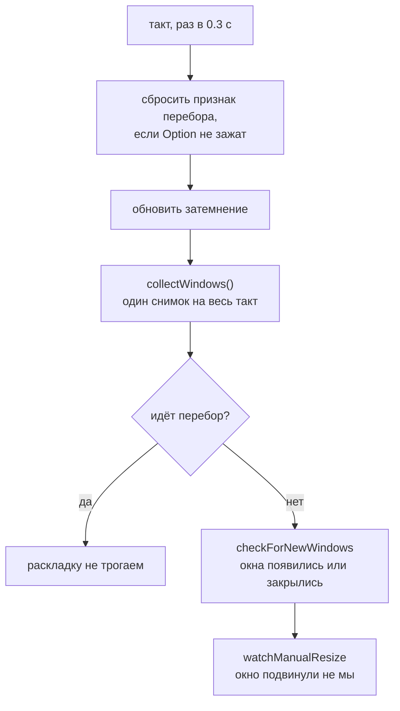
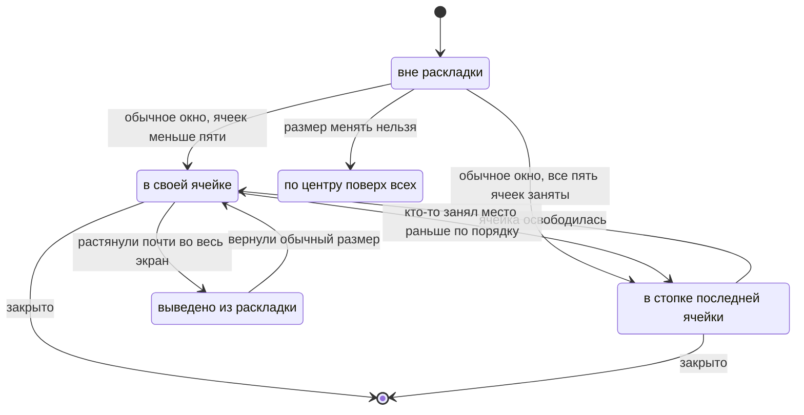
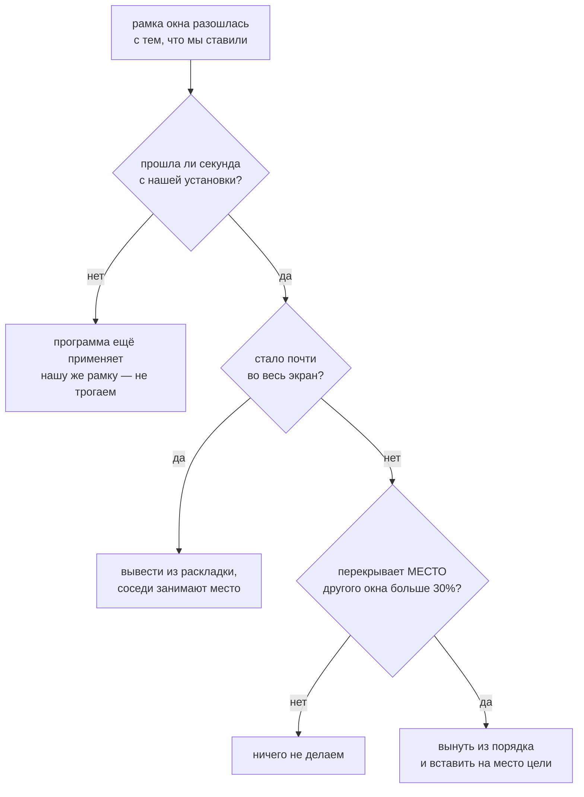

# Устройство WinCycle

Документ для того, кто будет менять код — свой или чужой. Здесь то, чего не видно из самого кода: почему сделано именно так, какие решения уже пробовали и отбросили, и на каких граблях этот проект уже прыгал.

Сам код — один файл `main.swift`, зависимостей за пределами AppKit и Carbon нет.

---

## 1. Из чего собрано

Три задачи в одном приложении, все три работают от одного и того же снимка окон.


Приватных API нет ни одного. Это не идеология, а необходимость: система на бете, всё недокументированное там ломается первым.

**Почему два источника, а не один.** `CGWindowList` знает, какие окна реально на экране и в каком порядке они лежат друг над другом, но двигать окна не умеет. Accessibility умеет двигать и знает заголовки, но не знает z-порядка и показывает окна с других рабочих столов. Нужно и то и другое, поэтому окна приходится сопоставлять между двумя списками — см. раздел 5, это самое хрупкое место во всём приложении.

---

## 2. Такт опроса

Всё происходит в одном таймере на 0.3 секунды. Отдельных наблюдателей за окнами нет: система не даёт уведомлений о том, что окно передвинули.



Снимок делается **один раз за такт** и передаётся обеим задачам. Не ради экономии: если каждая опросит систему сама, они увидят чуть разные состояния и начнут спорить друг с другом.

Во время перебора раскладка намеренно молчит — иначе окно, поднятое на передний план, тут же считалось бы переставленным.

---

## 3. Раскладка: dwindle

Схема как в Hyprland по умолчанию. Первое окно занимает экран целиком. Каждое следующее делит пополам ячейку **последнего добавленного** окна; направление деления выбирается по пропорциям самой ячейки — широкая делится вертикально, высокая горизонтально. Получается спираль: одно большое окно и всё более мелкие рядом.

```
   1 окно            2 окна             3 окна
┌───────────┐   ┌─────┬─────┐     ┌─────┬─────┐
│           │   │     │     │     │     │  2  │
│     1     │   │  1  │  2  │     │  1  ├─────┤
│           │   │     │     │     │     │  3  │
└───────────┘   └─────┴─────┘     └─────┴─────┘

   4 окна                5 окон
┌─────┬─────┐        ┌─────┬─────┐
│     │  2  │        │     │  2  │
│  1  ├──┬──┤        │  1  ├──┬──┤
│     │3 │4 │        │     │3 │4 │
│     │  │  │        │     │  ├──┤
│     │  │  │        │     │  │5 │
└─────┴──┴──┘        └─────┴──┴──┘
```

Между окнами и по краю экрана — зазор 8pt, ровно такой же, какой даёт Raycast Window Management (измерено вживую). Внешний зазор — усечение видимой области экрана перед делением, внутренний вставлен прямо в точку каждого деления, поэтому работает на любом уровне спирали.

### Предел в пять ячеек

Шестая ячейка на экране ноутбука уже меньше трёхсот точек — читать в ней нечего. Поэтому ячеек максимум пять (`maxTiles`), а всё сверх складывается **стопкой в последнюю, самую маленькую ячейку**: видно верхнее окно, остальные под ним. Сверху всегда самое новое — его только что открыли, значит с ним и собираются работать.

Ничего при этом не теряется: перебор Option+Tab ходит по **всем** окнам, а не только по видимым, так что до спрятанного окна можно добраться без нового сочетания клавиш. Это и было главным доводом за стопку против остальных вариантов (плавать по центру поверх сетки, вытеснять самое давнее окно сворачиванием в Dock, делить без предела).

**Стопка и перебор.** Дойдя до спрятанного окна, перебор поднимает его на верх стопки — видно, что именно выбрано. Чтобы выбор не пропал, наверх стопки при каждом пересчёте поднимается не «последнее по порядку раскладки» окно, а то, которое и так впереди по системному z-порядку. Для только что открытого окна это оно само, для найденного перебором — тоже оно. Одно правило покрывает оба случая.

**Стопка ломает три допущения сразу.** Все её окна стоят на одном месте, и это не случайность, а норма — на неё завязаны сразу несколько механизмов, которые раньше молча полагались на то, что рамки окон различаются:

- сопоставление системного списка с Accessibility (см. раздел 5) обязано быть однозначным, иначе окна стопки перепутаются между собой;
- распознавание ручных перестановок (раздел 6) обязано пропускать соседей по стопке — у них перекрытие всегда стопроцентное, и любое расхождение рамки внутри стопки читалось бы как «окно заняло чужую ячейку»;
- круговая сортировка перебора (раздел 7) обязана иметь запасной признак при равных углах — у окон стопки общий центр, а значит и одинаковый угол.

### Что в раскладку не попадает

| Окно | Что с ним делают | Почему |
|---|---|---|
| Настоящий системный полноэкранный режим (`AXFullScreen`) | не трогают вовсе | живёт на отдельном рабочем столе |
| Размер менять нельзя (настройки системы, Command+,) | ставят по центру экрана поверх остальных | под ячейку его всё равно не растянуть |
| Растянуто почти во весь экран **вручную** | временно выводится из раскладки, соседи занимают освободившееся место | человек сделал это специально; вернёт обычный размер — окно само вернётся |
| Свёрнутые, спрятанные Command+H, панели и диалоги | не попадают в снимок вообще | это не рабочие окна |
| `ignoredBundleIDs` | не попадают в снимок | точечный список для окон, неотличимых от настоящих никаким публичным признаком (найдено на фоновом окне VPN-клиента Happ) |

---

## 4. Жизненный цикл окна в раскладке



Окна, которые уже стояли на экране в момент запуска WinCycle, берутся под наблюдение сразу, но **не двигаются**: каждому «своей» объявляется та рамка, где оно и так стоит. Вид экрана не меняется, зато следующая же перестановка или новое окно пересчитают всё уже вместе с ними.

Порядок при этом восстанавливается **по геометрии, а не по слоям**: в спирали каждая следующая ячейка не больше предыдущей, поэтому сортировка «от большего окна к меньшему» воспроизводит исходный порядок раскладки — а после каждой пересборки она на экране именно та, что была. Равные по площади (последняя пара ячеек и окна одной стопки) разводятся по положению, сверху вниз и слева направо.

---

## 5. Сопоставление окон: самое хрупкое место

Общего идентификатора между `CGWindowList` и Accessibility публичный API не даёт. Сопоставлять приходится по тому, что видно с обеих сторон: программа-владелец, координаты, заголовок.

Порядок такой:

1. отбросить элементы, уже отданные другому окну на этом же такте;
2. если заголовок известен и совпал ровно с одним элементом — берём его;
3. иначе — ближайший по сумме отклонений рамки, с допуском.

**Почему нельзя просто «первый, чья рамка совпала».** Ровно в том случае, ради которого вся раскладка и писалась — окно переставляют на место другого окна **той же программы** — оба окна на один такт стоят на одинаковых координатах. Оба сопоставляются с одним элементом, раскладка дважды двигает одно окно и ни разу второе, второе остаётся не на месте, на следующем такте это снова «ручное вмешательство» — и так до бесконечности. Вживую: два окна терминала, слипшихся в одной четверти, и журнал, заполняющийся пересчётом по нескольку раз в секунду.

Стопка делает совпадение рамок штатной ситуацией, а не редкой — там несколько окон **специально** стоят на одном месте. Поэтому однозначность сопоставления здесь не перестраховка, а обязательное условие.

---

## 6. Как распознаётся ручное вмешательство

Раскладка помнит, какую рамку сама поставила каждому окну (`lastAppliedFrame`). Расхождение с фактической означает, что окно подвинул кто-то другой.



Три вещи, каждая из которых уже была источником бага:

**Перекрытие, а не совпадение координат.** Чужие менеджеры окон считают свои половины и четверти независимо от нашей раскладки. Для половин координаты иногда случайно совпадают, для четвертей — почти никогда, даже когда визуально это одно и то же место. Поэтому ищем окно, чьё место новая рамка перекрывает больше всего.

**Сравнивать с `lastAppliedFrame` цели, а не с её текущим положением.** Два окна, переставленные в один такт, иначе не найдут друг друга: к моменту проверки оба уже уехали каждое со своего места.

**Номер ячейки брать ДО изъятия окна из порядка.** Иначе при движении вперёд по спирали изъятие сдвигает цель на шаг назад, и окно вставляется ровно туда, откуда его взяли.

### Перестановка — это каскад, а не обмен

Окно вынимается из своего места в порядке и вставляется на место цели. Всё, что было после точки вставки, сдвигается по спирали на шаг — как при обычном открытии нового окна. Это не изолированный обмен двух окон местами.

```
порядок до:      [ A , B , C , D ]
                   ▲       │
                   └───────┘  C переставили на место A

порядок после:   [ C , A , B , D ]
                   
A не уехало на бывшее мелкое место C — оно сдвинулось на шаг,
и вместе с ним сдвинулось всё, что было между.
```

---

## 7. Перебор окон и затемнение

**Перебор.** Порядок — не по истории переключений, а по кругу на экране: окна сортируются по углу вокруг общего центра. Экранные координаты растут вниз, поэтому `atan2` даёт как раз движение по часовой стрелке, разворачивать ничего не нужно. Порядок снимается один раз в начале перебора и держится до отпускания Option — иначе список пересортировывался бы после каждой активации и «дальше» превращалось бы в прыжки между двумя окнами.

Признак «идёт перебор» гасится по отпусканию Option, но **дополнительно сверяется с фактическим состоянием клавиш на каждом такте**. Событие можно и не получить, а застрявший признак замораживает всю раскладку целиком.

**Затемнение.** Под активное окно подставляется полупрозрачная подложка во весь экран — всё, что под ней, притушено. Строка меню и Dock не затемняются: они на более высоком системном слое, обычным окном туда не дотянуться. Если на экране всего одно окно, подложка прячется — сравнивать не с чем, независимо от того, какого окно размера.

При переключении подложка двигается сразу, не дожидаясь следующего такта: иначе на треть секунды затемнённым оказалось бы как раз то окно, на которое переключились.

---

## 8. Ошибки, которые уже допущены

Каждая из них стоила отдельного круга «сломалось — разобрались — починили». Список нужен, чтобы не пройти его заново.

### Про угадывание намерений

**Эвристика «почти весь экран» по площади при первом взгляде на окно.** Порог 85% использовался, чтобы понять «человек развернул окно специально». Сломал раскладку дважды разными путями: сначала раскладка сама растягивала единственное окно на весь экран, а на следующем такте принимала его же за «развёрнуто специально» и забывала — тайлинг переставал работать после первого окна. Потом браузер восстановил из прошлой сессии старую растянутую рамку, и эвристика опять не пустила окно в раскладку.

> **Урок.** По размеру нельзя отличить «сделано специально» от «оказалось так по любой другой причине». Нужен либо честный системный признак (`AXFullScreen`), либо сравнение с собственным действием — «мы ставили сюда, а оно теперь там». Эвристика по площади осталась ровно в одном месте: применительно к расхождению с уже известной своей рамкой, где она заведомо безопасна — там она уже не может принять собственное размещение раскладки за чужое действие.

### Про асинхронность

**Мгновенное доверие расхождению рамки.** Просьба переставить окно выполняется не сразу: программа отвечает старой рамкой, пока применяет (а многие ещё и анимируют) новую. Только что размещённое окно тут же считалось переставленным вручную — по тому месту, где оно случайно открылось. На каждое новое окно шло два пересчёта подряд, второй по случайному поводу.

**Окно, пропавшее из снимка на один такт, принятое за закрытое.** Пока чужой менеджер двигает окно, два наших источника расходятся, сопоставить их не удаётся и окно исчезает из снимка. Раскладка успевала схлопнуться по числу оставшихся и развернуться обратно — видимый рывок соседних окон.

> **Урок.** Всё, что мы просим у чужой программы, выполняется не мгновенно и не обязательно точно. Ни расхождению, ни исчезновению нельзя верить с первого раза.

### Про состояние

**Экраны для пересчёта брались только из уже известной раскладки.** Сразу после запуска она пуста — и закрытие окна не приводило вообще ни к чему.

**Первый такт просто пропускал окна, уже стоявшие на экране.** Раскладка знала только окна, открытые после её запуска; всё остальное для неё не существовало, и перестановка такого окна не делала ничего. Особенно заметно после каждой пересборки — порядок живёт только в памяти.

**А когда их начали подхватывать — порядок брался из системного списка, то есть по слоям.** Записанный так порядок не имел отношения к тому, в каких ячейках окна реально стоят, и первый же пересчёт перекладывал всю раскладку заново. Причём слои меняются от любого переключения, так что результат зависел ещё и от того, на какое окно человек смотрел последним.

**Признак «идёт перебор» гасился только по событию.** Не пришло событие — признак остался взведённым, и вся раскладка замерла навсегда.

> **Урок.** Состояние, которое взводится событием, должно иметь способ восстановиться без события. И состояние, которое живёт только в памяти, обязано корректно подниматься с нуля на живом экране — это не редкий случай, а каждый запуск.

### Про новую сущность, ломающую старые допущения

Стопка добавилась последней и сломала сразу три места, каждое из которых до неё работало годами правильно — просто потому, что все они молча считали рамки окон различными.

**Соседи по стопке считали друг друга захватчиками ячейки.** Перекрытие у них всегда полное, поэтому малейшее расхождение рамки внутри стопки распознавалось как перестановка. Раскладка перетасовывалась сама по себе, окна прыгали между ячейками по шагу каждые пару секунд — особенно заметно при переборе, когда окно стопки поднимают на передний план.

**Перебор застревал внутри стопки.** У окон стопки общий центр, значит одинаковый угол в круговой сортировке; их взаимный порядок брался из входного списка, а тот идёт по слоям и меняется от каждого переключения. Перебор бесконечно прыгал между двумя окнами и дальше не шёл.

**Выбор перебором стирался следующим пересчётом.** Наверх стопки безусловно поднималось последнее окно по порядку раскладки, а не выбранное.

> **Урок.** Новая сущность, для которой прежнее неявное допущение перестаёт выполняться, ломает не одно место, а все, что на него опирались. Стоит выписать допущение явно («рамки окон различны») и пройти по всем его потребителям, а не чинить по одному месту за раз по мере жалоб.

### Про индексы и симметрию

**Номер ячейки-цели читался после изъятия окна из порядка.** Перестановка вперёд по спирали не делала вообще ничего: окно вставлялось туда, откуда его только что взяли. В обратную сторону работало, потому что там изъятие номер цели не меняет.

> **Урок.** Индексы в изменяемом массиве брать до мутации. И проверять **оба** направления: все ранние проверки этого механизма шли «назад по спирали», поэтому баг прожил несколько итераций незамеченным.

### Про методику проверки

**Сборка не той копии.** `build.sh` делает `cd "$(dirname "$0")"` и собирает `main.swift` из своей папки. Запуск копии скрипта из другого чекаута собирает **тот** чекаут — правки молча не попадают в сборку, и все проверки идут по старому коду.

**Вывод «проблема снаружи» без воспроизведения.** Однажды было заявлено, что горячие клавиши для четвертей просто не назначены в чужом менеджере окон. Они были назначены; баг был свой.

> **Урок.** Проверять тем же способом, каким пользуется человек, — настоящими горячими клавишами, а не синтетической перестановкой напрямую. И убеждаться, что запущено именно то, что только что правил.

---

## 9. Как проверять изменения

Пересобрать и запустить: `sh ./build.sh` **из той папки, где правили код**.

Что смотреть:

- **Журнал** — `~/Library/Logs/WinCycle.log`. Строка `dwindle: N окон — ...` на каждый пересчёт, с порядком окон. Две такие строки подряд с разным порядком — почти всегда признак ложного срабатывания распознавания ручных перестановок.
- **Фактические координаты** — читать `CGWindowListCopyWindowInfo` отдельным скриптом, а не верить журналу на слово: журнал показывает намерение раскладки, а не то, что программа в итоге сделала.
- **Настоящие горячие клавиши** — `osascript -e 'tell application "System Events" to key code N using {...}'`, предварительно наведя фокус на нужную программу. Имя процесса не всегда совпадает с названием: у веб-приложения это `Web App`.

Обязательный минимум перед тем, как считать изменение готовым:

1. рост числа окон 1 → 5 → 6, по одному пересчёту на окно;
2. закрытие окна из середины раскладки и из стопки;
3. перестановка клавишами **в обе стороны** по спирали;
4. перестановка сразу после перезапуска, без открытия и закрытия лишних окон;
5. окно с фиксированным размером (настройки любой программы через Command+,).

---

## 10. Что пробовали и отбросили

Готовые приложения — до того, как стало ясно, что своя утилита закрывает обе задачи лучше любой их комбинации:

| Что | Почему не подошло |
|---|---|
| AltTab | всегда рисует свою панель, фокус переводит только по отпусканию клавиши — живого перебора не даёт |
| JankyBorders | приватные API, открытые проблемы на свежих версиях системы |
| Tinkle | вспышка при переключении слишком слабая, не замечается |
| Alan | постоянная рамка вокруг окна |
| HazeOver | платный; заявленное размытие в нём кодом не подкреплено |
| Dimsum | работал через раз |

Своё размытие фона вместо затемнения тоже написали и отбросили: системные материалы `NSVisualEffectView` несут зернистую текстуру, на весь экран она читается как шум, убрать её нечем, а других способов размытия без приватных API нет.

Встроенной команды переключения окон у Raycast нет вовсе. Системное Command+ё («Следующее окно программы») работает, но только внутри одной программы.
