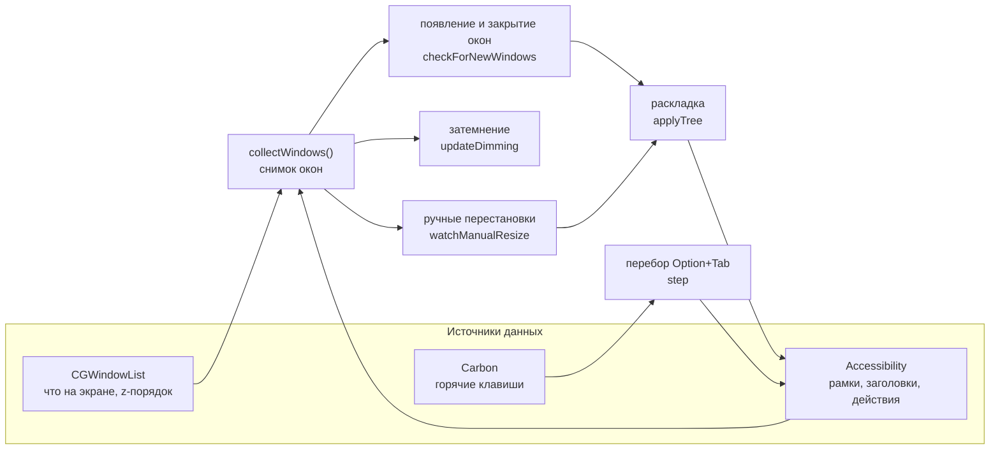
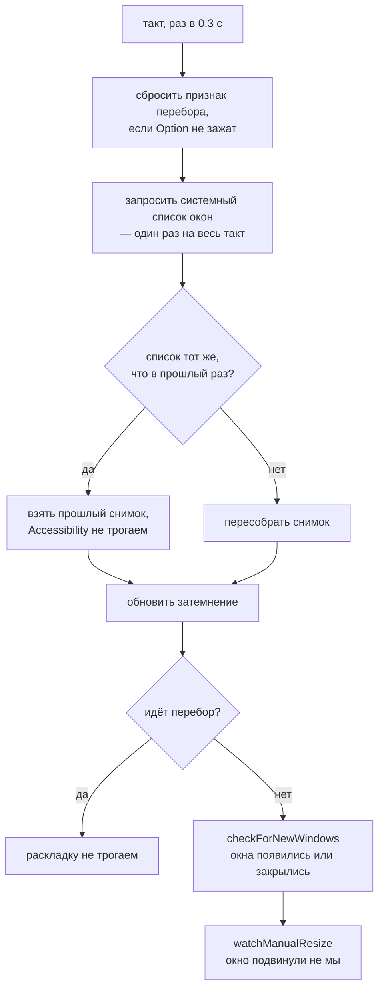
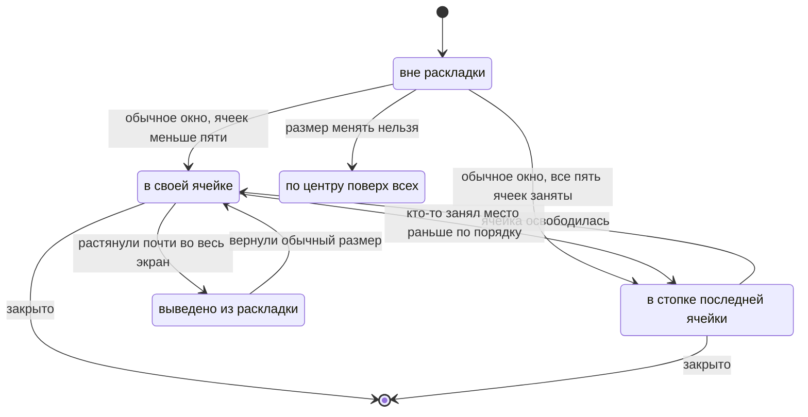
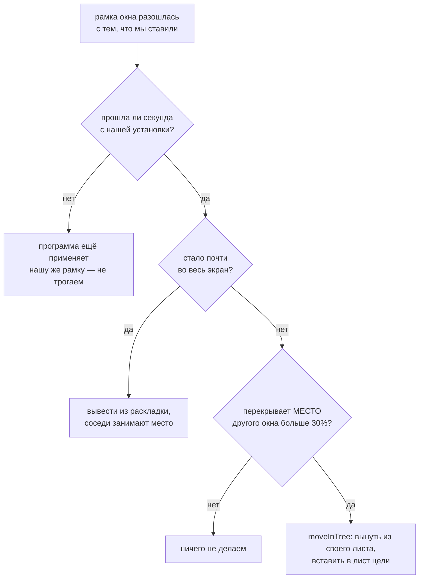

# Устройство WinCycle

Документ для того, кто будет менять код — свой или чужой. Здесь то, чего не видно из самого кода: почему сделано именно так, какие решения уже пробовали и отбросили, и на каких граблях этот проект уже прыгал.

Сам код — один файл `main.swift`, зависимостей за пределами AppKit и Carbon нет.

---

## 1. Из чего собрано

Три задачи в одном приложении, все три работают от одного и того же снимка окон.



Приватных API нет ни одного. Это не идеология, а необходимость: система на бете, всё недокументированное там ломается первым.

**Почему два источника, а не один.** `CGWindowList` знает, какие окна реально на экране и в каком порядке они лежат друг над другом, но двигать окна не умеет. Accessibility умеет двигать и знает заголовки, но не знает z-порядка и показывает окна с других рабочих столов. Нужно и то и другое, поэтому окна приходится сопоставлять между двумя списками — см. раздел 5, это самое хрупкое место во всём приложении.

---

## 2. Такт опроса

Всё происходит в одном таймере на 0.3 секунды. Отдельных наблюдателей за окнами нет: система не даёт уведомлений о том, что окно передвинули.



Список запрашивается **один раз за такт**, и снимок по нему строится тоже один — им пользуются все три задачи. Это не только экономия: если каждая опросит систему сама, они увидят чуть разные состояния и начнут спорить друг с другом.

Во время перебора раскладка намеренно молчит — иначе окно, поднятое на передний план, тут же считалось бы переставленным.

### Почему такт почти всегда пустой

Все решения выводятся из системного списка окон: какие окна есть, чьи они и где стоят. **Пока этот список не изменился, ни одно решение измениться не может** — значит и пересобирать снимок незачем. Экран почти всё время стоит без движения, так что подавляющее большинство тактов заканчивается сравнением списка с прошлым и выходом.

Что даёт этот признак право быть полным:

- свёрнутые окна и окна программ, спрятанных через Command+H, система **сама** убирает из списка (проверено вживую на обоих способах) — отдельно спрашивать Accessibility не нужно;
- полноэкранный режим меняет рамку окна, а рамка в признаке есть;
- порядок записей в списке — это z-порядок, от него зависит затемнение, и он тоже в признаке.

**Заголовок окна в признак не входит намеренно.** У терминала в заголовке крутится значок ожидания, у браузера меняется название ролика — признак менялся бы каждый такт, и весь выигрыш пропал бы.

Дороже всего обходится сопоставление окна из системного списка с элементом Accessibility: запрос рамки и заголовка на каждого кандидата. Оно постоянно на всё время жизни окна, поэтому запоминается — при следующей пересборке для уже известного окна не делается ни одного обращения. Так же запоминаются неизменяемые свойства окна: обычное ли оно и можно ли менять ему размер.

Измерено вживую на трёх окнах: **1.16 с процессорного времени за минуту до и 0.13 с после** — почти девятикратная разница. Основной вклад дали три вещи: пропуск такта целиком, снятие двойной работы (затемнение собирало собственный снимок, то есть вся работа с Accessibility делалась дважды за такт) и запоминание сопоставлений.

---

## 3. Раскладка: дерево разбиений

До этого раскладка была плоским списком окон (`tileOrder: [CGWindowID]`), а геометрия каждой ячейки выводилась ЗАНОВО каждый раз из одного лишь номера окна в этом списке — «N-е по счёту окно получает N-й по счёту кусок спирали» (dwindle, как в Hyprland по умолчанию). У такого списка не было понятия «вот эта конкретная ячейка на экране» — только «N-е окно», и переставить окно означало пересчитать номера, а не тронуть конкретный узел. Это работало, но плохо соответствовало тому, что человек видит на экране: перестановка одного окна могла (и должна была, по замыслу) задеть размеры окон, к перестановке отношения не имевших — см. разбор в разделе 8.

Теперь раскладка — настоящее дерево разбиений (`TileNode`), как в i3, bspwm или в dwindle-режиме Hyprland под капотом. Внутренний узел делит доставшуюся ему область на две; направление (`vertical: true` — вертикальная черта, лево/право; `false` — горизонтальная, верх/низ) и порядок сторон решаются **один раз, в момент деления**, по пропорциям делимой области — и дальше не пересматриваются. Лист либо держит одно окно, либо, при достижении предела ячеек, несколько окон одной стопкой на одном месте.

```
   1 окно            2 окна             3 окна
┌───────────┐   ┌─────┬─────┐     ┌─────┬─────┐
│           │   │     │     │     │     │  2  │
│     1     │   │  1  │  2  │     │  1  ├─────┤
│           │   │     │     │     │     │  3  │
└───────────┘   └─────┴─────┘     └─────┴─────┘
```

Между окнами и по краю экрана — зазор 8pt, ровно такой же, какой даёт Raycast Window Management (измерено вживую). Внешний зазор — усечение видимой области экрана перед делением, внутренний вставлен прямо в точку каждого разреза (`halves`), поэтому работает на любом уровне дерева.

### Новое окно делит ячейку активного, а не последней добавленной

В Hyprland (и в первой версии этой раскладки) новое окно всегда делило ячейку последнего добавленного — независимо от того, где человек сейчас работает. Теперь по умолчанию делится ячейка **активного окна** (`activeLeaf`): новое окно появляется рядом с тем, с чем человек только что взаимодействовал, а не в произвольном углу спирали.

Активное окно на момент, когда опрос вообще ЗАМЕЧАЕТ новое окно, для этой цели не годится: открытие документа само крадёт фокус, и почти всегда к моменту обнаружения передним уже стоит только что открывшееся окно, а не то, где человек работал секунду назад. Поэтому используется `lastObservedFrontID` — переднее окно на конец **прошлого** такта, захваченное до того, как затемнение успело его перезаписать текущим. Если активное окно не отслеживается на этом экране (на другом мониторе, или это не обычное окно) — по умолчанию берётся хвост спирали (`tailLeaf`, самый мелкий лист), как и раньше.

### Предел в пять ячеек

Шестая ячейка на экране ноутбука уже меньше трёхсот точек — читать в ней нечего. Поэтому листьев максимум пять (`maxTiles`), а всё сверх складывается **стопкой в хвосте спирали** — самом мелком листе, независимо от того, где сейчас активное окно (переполнение не может расталкивать активную ячейку, для него отведено ровно одно место): видно верхнее окно, остальные под ним.

Ничего при этом не теряется: перебор Option+Tab ходит по **всем** окнам, а не только по видимым, так что до спрятанного окна можно добраться без нового сочетания клавиш.

**Стопка и перебор.** Дойдя до спрятанного окна, перебор поднимает его на верх стопки — видно, что именно выбрано. Чтобы выбор не пропал, наверх стопки при каждом пересчёте поднимается не «последнее по списку» окно, а то, которое и так впереди по системному z-порядку. Для только что открытого окна это оно само, для найденного перебором — тоже оно. Одно правило покрывает оба случая.

**Стопка ломает три допущения сразу.** Все её окна стоят на одном месте, и это не случайность, а норма — на неё завязаны сразу несколько механизмов, которые раньше молча полагались на то, что рамки окон различаются:

- сопоставление системного списка с Accessibility (см. раздел 5) обязано быть однозначным, иначе окна стопки перепутаются между собой;
- распознавание ручных перестановок (раздел 6) обязано пропускать соседей по стопке — у них перекрытие всегда стопроцентное, и любое расхождение рамки внутри стопки читалось бы как «окно заняло чужую ячейку»;
- круговая сортировка перебора (раздел 7) обязана иметь запасной признак при равных углах — у окон стопки общий центр, а значит и одинаковый угол.

**Перестановка окна из стопки на видимую ячейку — единственное место, где дерево немного упрощено.** По правилам (раздел 6) это должно было бы разделить ячейку цели, но тогда число листьев превысило бы `maxTiles`. Вместо честного «вытеснить прежнего хозяина ячейки в стопку» окно просто присоединяется к листу цели без деления — если цель была обычной ячейкой, она тоже становится стопкой на двоих. Работает и не путает, но заслуживает более честной реализации при случае.

### Что в раскладку не попадает

| Окно | Что с ним делают | Почему |
|---|---|---|
| Настоящий системный полноэкранный режим (`AXFullScreen`) | не трогают вовсе | живёт на отдельном рабочем столе |
| Размер менять нельзя (настройки системы, Command+,) | ставят по центру экрана поверх остальных | под ячейку его всё равно не растянуть |
| Растянуто почти во весь экран **вручную** | временно выводится из раскладки, соседи занимают освободившееся место | человек сделал это специально; вернёт обычный размер — окно само вернётся |
| Свёрнутые, спрятанные Command+H, панели и диалоги | не попадают в снимок вообще | это не рабочие окна |
| `ignoredBundleIDs` | не попадают в снимок | точечный список для окон, неотличимых от настоящих никаким публичным признаком (найдено на фоновом окне VPN-клиента Happ) |

---

## 4. Жизненный цикл окна в раскладке



Окна, которые уже стояли на экране в момент запуска WinCycle, берутся под наблюдение сразу, но **не двигаются**: дерево строится тем же способом, что и обычный рост (`insertNew` для каждого по очереди), но реальные рамки окон не трогаем — `lastAppliedFrame` ставится в ту рамку, где окно и так стоит. Вид экрана не меняется, зато следующая же перестановка или новое окно пересчитают всё уже вместе с ними, и дерево к тому моменту уже имеет правильную форму.

Порядок обхода при построении — **по геометрии, а не по слоям**: сортировка «от большего окна к меньшему» (равные по площади разводятся по положению, сверху вниз и слева направо) воспроизводит исходный порядок роста раскладки, если она на экране уже была, — а после каждой пересборки она именно там и есть. Системный список окон для этого не годится: он идёт по слоям и меняется от любого переключения.

---

## 5. Сопоставление окон: самое хрупкое место

Общего идентификатора между `CGWindowList` и Accessibility публичный API не даёт. Сопоставлять приходится по тому, что видно с обеих сторон: программа-владелец, координаты, заголовок.

Порядок такой:

1. отбросить элементы, уже отданные другому окну на этом же такте;
2. если свободный кандидат остался один — берём его, ошибиться негде;
3. если заголовок известен и совпал ровно с одним элементом — берём его;
4. иначе — ближайший по сумме отклонений рамки, с допуском.

Найденное сопоставление запоминается на всё время жизни окна — но **только если оно уверенное** (случаи 2 и 3). Если пришлось выбирать из нескольких неразличимых кандидатов, ошибка закрепилась бы навсегда; такое сопоставление используется на этот раз, но не запоминается, и на следующем изменении попытка повторяется — к тому времени окна обычно уже разъехались.

**Почему нельзя просто «первый, чья рамка совпала».** Ровно в том случае, ради которого вся раскладка и писалась — окно переставляют на место другого окна **той же программы** — оба окна на один такт стоят на одинаковых координатах. Оба сопоставляются с одним элементом, раскладка дважды двигает одно окно и ни разу второе, второе остаётся не на месте, на следующем такте это снова «ручное вмешательство» — и так до бесконечности. Вживую: два окна терминала, слипшихся в одной четверти, и журнал, заполняющийся пересчётом по нескольку раз в секунду.

Стопка делает совпадение рамок штатной ситуацией, а не редкой — там несколько окон **специально** стоят на одном месте. Поэтому однозначность сопоставления здесь не перестраховка, а обязательное условие.

---

## 6. Как распознаётся ручное вмешательство

Раскладка помнит, какую рамку сама поставила каждому окну (`lastAppliedFrame`). Расхождение с фактической означает, что окно подвинул кто-то другой.



Две вещи, каждая из которых уже была источником бага:

**Перекрытие, а не совпадение координат.** Чужие менеджеры окон считают свои половины и четверти независимо от нашей раскладки. Для половин координаты иногда случайно совпадают, для четвертей — почти никогда, даже когда визуально это одно и то же место. Поэтому ищем окно, чьё место новая рамка перекрывает больше всего.

**Сравнивать с `lastAppliedFrame` цели, а не с её текущим положением.** Два окна, переставленные в один такт, иначе не найдут друг друга: к моменту проверки оба уже уехали каждое со своего места.

### Перестановка — это местная операция дерева, а не глобальный пересчёт

`moveInTree` вынимает окно из его листа (`removing`) и вставляет в лист цели (`splitting`). Если окно было единственным в своём листе, узел схлопывается — сосед по разрезу получает освободившееся место целиком; если после этого в дереве осталось меньше `maxTiles` листьев, лист цели делится пополам, прежний хозяин ячейки и переставленное окно получают по половине. Соседей, к перестановке отношения не имевших, это не касается вовсе — в этом разница с прежним плоским списком, где «переставить одно окно» пересчитывало размеры всех окон после точки вставки.

```
дерево до:                              после C → в ячейку A:
┌─────┬─────┐                          ┌──┬──┐
│     │  B  │   A — целый лист,        │C │ B│    A и C поделили
│  A  ├──┬──┤   D — сосед C            │  ├──┤    бывшую ячейку A
│     │C │D │   по одному разрезу      │  │ D│    пополам; B цела,
└─────┴──┴──┘                          └──┴──┘    D выросла (забрала
                                                    место C целиком)
```

Раньше, при плоском списке, та же перестановка была вставкой по индексу — «вынуть C, вставить перед A, всё после точки вставки сдвинуть на шаг» — и в этой арифметике B тоже меняла размер, хотя физически с перестановкой не соприкасалась. Дерево устраняет это: меняются только два узла, действительно участвовавших в обмене, и их непосредственные соседи по разрезу.

---

## 7. Перебор окон и затемнение

**Перебор.** Порядок — не по истории переключений, а по кругу на экране: окна сортируются по углу вокруг общего центра. Экранные координаты растут вниз, поэтому `atan2` даёт как раз движение по часовой стрелке, разворачивать ничего не нужно. Порядок снимается один раз в начале перебора и держится до отпускания Option — иначе список пересортировывался бы после каждой активации и «дальше» превращалось бы в прыжки между двумя окнами.

Признак «идёт перебор» гасится по отпусканию Option, но **дополнительно сверяется с фактическим состоянием клавиш на каждом такте**. Событие можно и не получить, а застрявший признак замораживает всю раскладку целиком.

**Затемнение.** Под активное окно подставляется полупрозрачная подложка во весь экран — всё, что под ней, притушено. Строка меню и Dock не затемняются: они на более высоком системном слое, обычным окном туда не дотянуться. Если на экране всего одно окно, подложка прячется — сравнивать не с чем, независимо от того, какого окно размера.

При переключении подложка двигается сразу, не дожидаясь следующего такта: иначе на треть секунды затемнённым оказалось бы как раз то окно, на которое переключились.

---

## 8. Ошибки, которые уже допущены

Каждая из них стоила отдельного круга «сломалось — разобрались — починили». Список нужен, чтобы не пройти его заново.

### Про угадывание намерений

**Эвристика «почти весь экран» по площади при первом взгляде на окно.** Порог 85% использовался, чтобы понять «человек развернул окно специально». Сломал раскладку дважды разными путями: сначала раскладка сама растягивала единственное окно на весь экран, а на следующем такте принимала его же за «развёрнуто специально» и забывала — тайлинг переставал работать после первого окна. Потом браузер восстановил из прошлой сессии старую растянутую рамку, и эвристика опять не пустила окно в раскладку.

> **Урок.** По размеру нельзя отличить «сделано специально» от «оказалось так по любой другой причине». Нужен либо честный системный признак (`AXFullScreen`), либо сравнение с собственным действием — «мы ставили сюда, а оно теперь там». Эвристика по площади осталась ровно в одном месте: применительно к расхождению с уже известной своей рамкой, где она заведомо безопасна — там она уже не может принять собственное размещение раскладки за чужое действие.

### Про асинхронность

**Мгновенное доверие расхождению рамки.** Просьба переставить окно выполняется не сразу: программа отвечает старой рамкой, пока применяет (а многие ещё и анимируют) новую. Только что размещённое окно тут же считалось переставленным вручную — по тому месту, где оно случайно открылось. На каждое новое окно шло два пересчёта подряд, второй по случайному поводу.

**Окно, пропавшее из снимка на один такт, принятое за закрытое.** Пока чужой менеджер двигает окно, два наших источника расходятся, сопоставить их не удаётся и окно исчезает из снимка. Раскладка успевала схлопнуться по числу оставшихся и развернуться обратно — видимый рывок соседних окон.

> **Урок.** Всё, что мы просим у чужой программы, выполняется не мгновенно и не обязательно точно. Ни расхождению, ни исчезновению нельзя верить с первого раза.

### Про состояние

**Экраны для пересчёта брались только из уже известной раскладки.** Сразу после запуска она пуста — и закрытие окна не приводило вообще ни к чему.

**Первый такт просто пропускал окна, уже стоявшие на экране.** Раскладка знала только окна, открытые после её запуска; всё остальное для неё не существовало, и перестановка такого окна не делала ничего. Особенно заметно после каждой пересборки — порядок живёт только в памяти.

**А когда их начали подхватывать — порядок брался из системного списка, то есть по слоям.** Записанный так порядок не имел отношения к тому, в каких ячейках окна реально стоят, и первый же пересчёт перекладывал всю раскладку заново. Причём слои меняются от любого переключения, так что результат зависел ещё и от того, на какое окно человек смотрел последним.

**Признак «идёт перебор» гасился только по событию.** Не пришло событие — признак остался взведённым, и вся раскладка замерла навсегда.

> **Урок.** Состояние, которое взводится событием, должно иметь способ восстановиться без события. И состояние, которое живёт только в памяти, обязано корректно подниматься с нуля на живом экране — это не редкий случай, а каждый запуск.

### Про новую сущность, ломающую старые допущения

Стопка добавилась последней и сломала сразу три места, каждое из которых до неё работало годами правильно — просто потому, что все они молча считали рамки окон различными.

**Соседи по стопке считали друг друга захватчиками ячейки.** Перекрытие у них всегда полное, поэтому малейшее расхождение рамки внутри стопки распознавалось как перестановка. Раскладка перетасовывалась сама по себе, окна прыгали между ячейками по шагу каждые пару секунд — особенно заметно при переборе, когда окно стопки поднимают на передний план.

**Перебор застревал внутри стопки.** У окон стопки общий центр, значит одинаковый угол в круговой сортировке; их взаимный порядок брался из входного списка, а тот идёт по слоям и меняется от каждого переключения. Перебор бесконечно прыгал между двумя окнами и дальше не шёл.

**Выбор перебором стирался следующим пересчётом.** Наверх стопки безусловно поднималось последнее окно по порядку раскладки, а не выбранное.

> **Урок.** Новая сущность, для которой прежнее неявное допущение перестаёт выполняться, ломает не одно место, а все, что на него опирались. Стоит выписать допущение явно («рамки окон различны») и пройти по всем его потребителям, а не чинить по одному месту за раз по мере жалоб.

### Про лишнюю работу

**Затемнение собирало собственный снимок окон.** Внутри у него была своя проверка «сколько всего окон на экране», и она вызывала полный сбор — со всеми обращениями к Accessibility. А сразу после этого тот же сбор делал таймер для раскладки. Вся тяжёлая работа выполнялась дважды за каждый такт, и по коду это было не видно: два разных места, каждое по отдельности выглядело разумно.

**Каждый такт спрашивалось то, что уже известно.** Свёрнуто ли окно и спрятана ли программа — отдельные запросы к Accessibility на каждое окно, хотя система и так не показывает такие окна в списке. Обычное ли это окно и можно ли менять ему размер — свойства, которые за жизнь окна не меняются, а спрашивались три раза в секунду. Сопоставление с элементом Accessibility — самая дорогая операция из всех — пересчитывалось с нуля каждый такт, хотя оно постоянно.

> **Урок.** Опрос по таймеру прячет стоимость: всё «работает», просто греет процессор. Прежде чем ускорять сам обход, стоит посмотреть, что из него вообще можно не делать — сколько раз за такт спрашивается одно и то же, и что из спрошенного не могло измениться с прошлого раза. Здесь это дало почти девятикратную разницу без единого изменения в поведении.

### Про индексы и симметрию

Из времён плоского списка (`tileOrder: [CGWindowID]`), до перехода на дерево разбиений (раздел 3) — сама структура данных, где жил этот баг, с тех пор заменена, но урок общий и не привязан к ней.

**Номер ячейки-цели читался после изъятия окна из порядка.** Перестановка вперёд по спирали не делала вообще ничего: окно вставлялось туда, откуда его только что взяли. В обратную сторону работало, потому что там изъятие номер цели не меняет.

> **Урок.** Индексы в изменяемом массиве брать до мутации. И проверять **оба** направления: все ранние проверки этого механизма шли «назад по спирали», поэтому баг прожил несколько итераций незамеченным.

### Про то, что «сейчас» уже не то, каким кажется

**Активное окно на момент, когда опрос замечает новое, — это почти всегда само новое окно.** При добавлении «новое окно делит ячейку активного» (раздел 3) первая версия брала переднее окно СВЕЖИМ, тем же тактом, что и обнаружение нового окна. Открытие документа само крадёт фокус быстрее, чем успевает пройти один такт опроса (0.3с) — так что почти в 100% случаев «активным» оказывалось только что открывшееся окно, которое ещё не в дереве, `activeLeaf` находил его в дереве нет и падал на запасной вариант (хвост спирали). Внешне это выглядело так, будто вся фича не работает: новое окно упрямо лезло в хвост спирали, как в старой версии, независимо от того, где реально работал человек.

> **Урок.** «Текущее состояние» на момент, когда что-то замечено, часто уже успело измениться самим этим событием. Нужно не текущее значение, а то, что было МГНОВЕНИЕ назад, до события, — здесь это переднее окно на конец прошлого такта (`lastObservedFrontID`), захваченное до того, как что-то другое успеет его перезаписать.

### Про методику проверки

**Сборка не той копии.** `build.sh` делает `cd "$(dirname "$0")"` и собирает `main.swift` из своей папки. Запуск копии скрипта из другого чекаута собирает **тот** чекаут — правки молча не попадают в сборку, и все проверки идут по старому коду.

**Вывод «проблема снаружи» без воспроизведения.** Однажды было заявлено, что горячие клавиши для четвертей просто не назначены в чужом менеджере окон. Они были назначены; баг был свой.

> **Урок.** Проверять тем же способом, каким пользуется человек, — настоящими горячими клавишами, а не синтетической перестановкой напрямую. И убеждаться, что запущено именно то, что только что правил.

---

## 9. Как проверять изменения

Пересобрать и запустить: `sh ./build.sh` **из той папки, где правили код**.

Что смотреть:

- **Журнал** — `~/Library/Logs/WinCycle.log`. Строка `раскладка: N окон — ...` на каждый пересчёт, с порядком листьев дерева (не окон по важности). Две такие строки подряд без видимой причины — почти всегда признак ложного срабатывания распознавания ручных перестановок.
- **Фактические координаты** — читать `CGWindowListCopyWindowInfo` отдельным скриптом, а не верить журналу на слово: журнал показывает намерение раскладки, а не то, что программа в итоге сделала. Особенно важно для дерева: две строки с одинаковым набором окон могут скрывать разную ФОРМУ (кто чью ячейку поделил), которую по одному только списку владельцев не увидеть.
- **Настоящие горячие клавиши** — `osascript -e 'tell application "System Events" to key code N using {...}'`, предварительно наведя фокус на нужную программу. Имя процесса не всегда совпадает с названием: у веб-приложения это `Web App`.

Обязательный минимум перед тем, как считать изменение готовым:

1. рост числа окон 1 → 5 → 6, по одному пересчёту на окно;
2. закрытие окна из середины раскладки и из стопки;
3. перестановка клавишами **в обе стороны** по дереву (в крупную ячейку и из неё);
4. перестановка сразу после перезапуска, без открытия и закрытия лишних окон;
5. окно с фиксированным размером (настройки любой программы через Command+,);
6. новое окно делит ячейку АКТИВНОГО окна, а не хвост спирали — навести фокус на конкретное окно, подождать хотя бы один такт (0.3с+), открыть новое;
7. перебор Option+Tab с реально зажатым Option (не отдельные нажатия с отпусканием между ними — это каждый раз начинает новый перебор заново) проходит все окна и замыкает круг;
8. расход процессора в покое.

Расход мерить по накопленному процессорному времени, а не по мгновенному проценту:

```sh
PID=$(pgrep WinCycle); ps -o time= -p $PID; sleep 60; ps -o time= -p $PID
```

Ориентир на трёх окнах — около **0.13 с за минуту**. Если стало заметно больше, значит признак «экран не изменился» перестал срабатывать и снимок пересобирается каждый такт. Первый подозреваемый — что-то меняющееся само по себе попало в признак.

---

## 10. Рабочие столы (Spaces)

Проверено вживую (пользователь создал второй стол через Mission Control и переключился туда и обратно, я следил за журналом и координатами): переключение стола **не сбрасывает раскладку**. Журнал за всё время переключения — полностью пустой, ни намёка на закрытие или пересчёт. Значит `CGWindowListCopyWindowInfo` с флагом `.optionOnScreenOnly` в этой версии macOS не убирает окна с неактивного стола того же дисплея из списка — опасение, что переключение стола выглядело бы для раскладки как закрытие всех окон разом, не подтвердилось.

Отдельно проверено (безопасным способом, без реального второго стола): запрос БЕЗ `.optionOnScreenOnly` видит окна, даже когда они свёрнуты — то есть в принципе отличить «окно закрыто» от «просто сейчас не видно» технически можно, если такая необходимость всё же когда-нибудь возникнет (например, на другой машине или версии системы, где поведение окажется иным). Делать это сейчас не стали — живой тест показал, что проблема не проявляется.

---

## 11. Что пробовали и отбросили

Готовые приложения — до того, как стало ясно, что своя утилита закрывает обе задачи лучше любой их комбинации:

| Что | Почему не подошло |
|---|---|
| AltTab | всегда рисует свою панель, фокус переводит только по отпусканию клавиши — живого перебора не даёт |
| JankyBorders | приватные API, открытые проблемы на свежих версиях системы |
| Tinkle | вспышка при переключении слишком слабая, не замечается |
| Alan | постоянная рамка вокруг окна |
| HazeOver | платный; заявленное размытие в нём кодом не подкреплено |
| Dimsum | работал через раз |

Своё размытие фона вместо затемнения тоже написали и отбросили: системные материалы `NSVisualEffectView` несут зернистую текстуру, на весь экран она читается как шум, убрать её нечем, а других способов размытия без приватных API нет.

Встроенной команды переключения окон у Raycast нет вовсе. Системное Command+ё («Следующее окно программы») работает, но только внутри одной программы.
