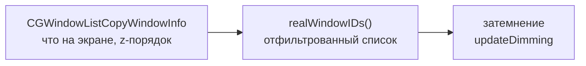

# Устройство WinCycle

Документ для того, кто будет менять код — свой или чужой. Здесь то, чего не видно из самого кода: почему сделано именно так, какие решения уже пробовали и отбросили, и на каких граблях этот проект уже прыгал.

Сам код — один файл `main.swift`, зависимостей за пределами AppKit нет.

> Раньше в этом файле умели ещё перебор окон (Option+Tab) и dwindle-тайлинг новых окон — вся эта функциональность и связанная с ней инфраструктура (Carbon-горячие клавиши, Accessibility API, сопоставление системного списка окон с AX-элементами) удалены целиком по прямой просьбе, осталось только затемнение. Разделы про раскладку и перебор из этого документа тоже убраны — им больше нечего описывать.

---

## 1. Из чего собрано

Одна задача, один источник данных.

Приватных API нет ни одного, и Accessibility тоже не используется: `CGWindowListCopyWindowInfo` даёт всё нужное — какие окна реально на экране и в каком порядке они лежат друг над другом. Двигать чужие окна WinCycle не пытается вовсе, поэтому Accessibility ему и не нужна — переставляются только собственные прозрачные подложки (`NSWindow.order(.below, relativeTo:)`), а это делается штатным AppKit API без каких-либо разрешений.

---

## 2. Такт опроса

Две независимые точки обновления:

- уведомление `NSWorkspace.didActivateApplicationNotification` — срабатывает мгновенно при смене активной программы;
- таймер на 0.3 секунды — добирает переключение между окнами одной и той же программы, которое уведомление не ловит.

Обе точки вызывают один и тот же `updateDimming`, порядок подложек трогается только когда самое переднее окно действительно сменилось (`force || front != lastFront`) — иначе на каждом такте было бы видимое мерцание.

---

## 3. Затемнение

Под самое переднее обычное окно подставляется полупрозрачная подложка (`Overlay`/`ShadeView`) во весь экран — всё, что оказалось под ней, притушено. Подложка:

- не перехватывает мышь (`ignoresMouseEvents`);
- висит на всех рабочих столах (`canJoinAllSpaces, .stationary`);
- никогда не становится активным окном (`canBecomeKey`/`canBecomeMain` — `false`).

Строка меню и Dock не затемняются: они на более высоком системном слое, обычным окном туда не дотянуться.

**Список окон для подсчёта** — `realWindowIDs()`. Берёт `CGWindowListCopyWindowInfo` (слой 0, видимое на экране) и по пути отфильтровывает:

| Что отфильтровывается | Почему |
|---|---|
| собственные подложки | иначе подложка считала бы сама себя вторым окном |
| альфа < 0.01 | окно есть в списке, но фактически невидимо |
| меньше 100×100 точек | мелкие всплывающие панельки — не рабочие окна |
| программы вне `.regular` (значки в строке меню и подобные) | переключаться на них бессмысленно, их не с чем сравнивать |
| программы, спрятанные Command+H | окно осталось в системном списке, но реально не на экране |
| `ignoredBundleIDs` | точечный список для окон, неотличимых от настоящих никаким публичным признаком (найдено на фоновом окне VPN-клиента Happ — `su.ffg.happ`) |

**Если реальных окон на экране одно или ноль — подложки прячутся.** Затемнять относительно чего? Сравнивать не с чем, а тёмная рамка по краям только мешала бы.

**Смена активного окна на лету.** При переключении между окнами (например, кликом) подложка двигается сразу по уведомлению, не дожидаясь следующего такта опроса — иначе на треть секунды затемнённым оказывалось бы как раз то окно, на которое переключились.

---

## 4. Ошибки, которые уже допущены

### Про разрешения после урезания функциональности

Когда из приложения убрали перебор и тайлинг (а вместе с ними — всю Accessibility-инфраструктуру), осталась только `CGWindowListCopyWindowInfo`, которая никаких разрешений не требует. Разрешение «Универсальный доступ», вокруг сохранения которого была выстроена вся система постоянной подписи в `build.sh`, для оставшейся функциональности больше не нужно вовсе.

> **Урок.** После того как выпилена крупная часть функциональности, стоит перепроверить не только код, но и всё, что было обвязкой вокруг неё, — разрешения, права, комментарии в соседних файлах. Обвязка часто переживает саму функциональность и вводит в заблуждение о том, что приложению всё ещё нужно.

### Про методику проверки

**Сборка не той копии.** `build.sh` делает `cd "$(dirname "$0")"` и собирает `main.swift` из своей папки. Запуск копии скрипта из другого чекаута собирает **тот** чекаут — правки молча не попадают в сборку, и все проверки идут по старому коду.

> **Урок.** Убеждаться, что запущено именно то, что только что правил, — не полагаться на память о том, откуда в прошлый раз собирали.

---

## 5. Как проверять изменения

Пересобрать и запустить: `sh ./build.sh` **из той папки, где правили код**.

Что смотреть:

- открыть два и более окна на одном экране — неактивные должны стать темнее, активное поверх подложки;
- оставить одно окно на экране — подложка должна пропасть;
- переключиться на другое окно (кликом или Cmd+Tab) — подложка должна переместиться без заметной задержки;
- поменять силу затемнения и включить/выключить его через меню в строке меню — применяется сразу;
- подключить/отключить второй монитор — подложки должны пересобраться под новый набор экранов (`screensChanged`);
- журнал — `~/Library/Logs/WinCycle.log`, строка `запуск` при каждом старте; убедиться, что не запущено сразу две копии («уже запущена другая копия — выхожу»).

---

## 6. Что пробовали и отбросили

Готовые приложения для подсветки активного окна затемнением — до того, как стало ясно, что своя утилита в пару сотен строк закрывает задачу лучше любого из них:

| Что | Почему не подошло |
|---|---|
| HazeOver | платный; заявленное размытие в нём кодом не подкреплено |
| Dimsum | работал через раз |

Своё размытие фона вместо затемнения тоже написали и отбросили: системные материалы `NSVisualEffectView` несут зернистую текстуру, на весь экран она читается как шум, убрать её нечем, а других способов размытия без приватных API нет.
